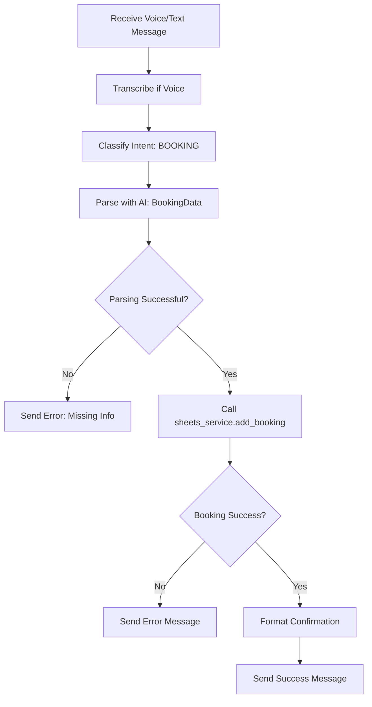
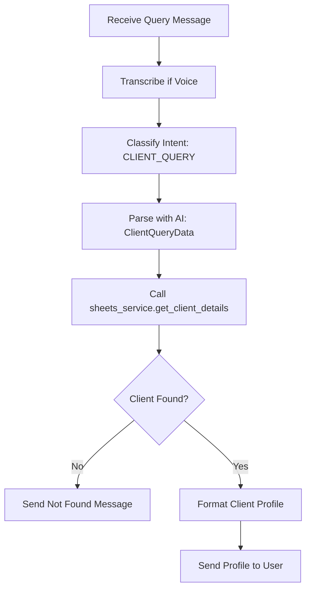
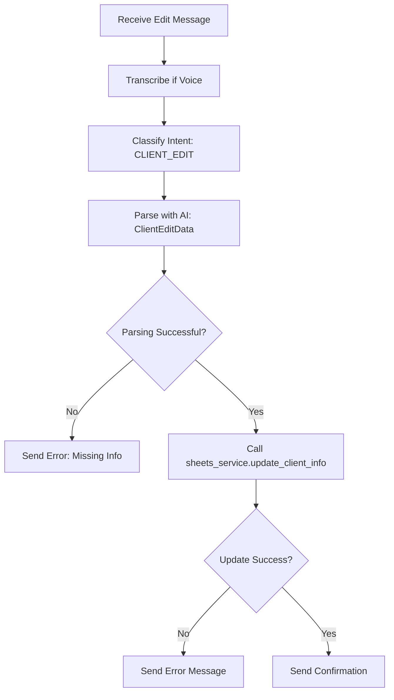
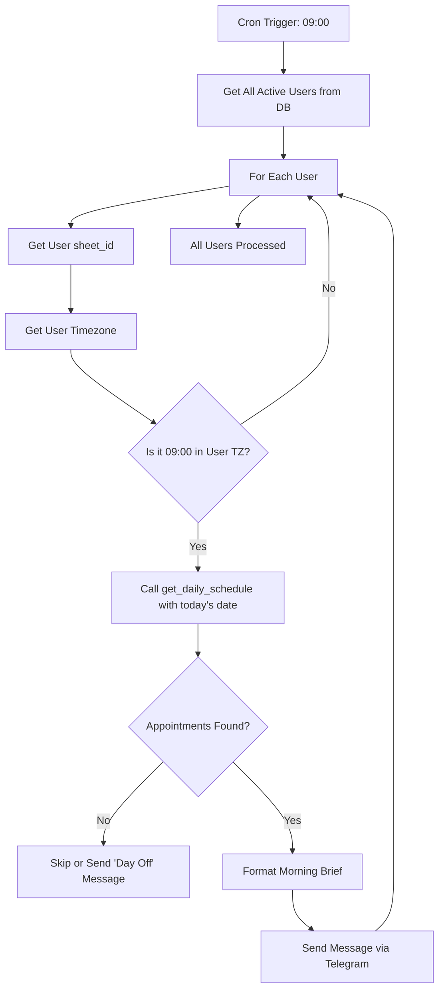

# Client Booking System Implementation

## Overview

This design outlines the implementation of four core CRM features for the Massage Therapist SaaS Bot: Client Lookup, Client Edit, Future Booking, and Daily Summary. The system will extend the existing MVP (which currently logs past sessions) to provide comprehensive client relationship management capabilities.

## Business Requirements

### 1. Client Lookup
Enable therapists to query client information through natural language voice or text commands.

**Use Cases:**
- "Who is Anna?" - Retrieve complete client profile
- "What's the issue with Ivan?" - Get medical history
- "Remind me about Olga" - View recent interactions

**Expected Response:**
Display client name, contact information, medical anamnesis, preferences, LTV, last visit date, and session history.

### 2. Client Edit
Allow therapists to append notes to client profiles without logging a session.

**Use Cases:**
- "Anna has a nut allergy" - Update medical notes
- "Olga asked for firmer pressure" - Add preference
- "Ivan requested lavender-free oil" - Update preferences

**Expected Response:**
Confirmation that the note has been added to the client's record.

### 3. Future Booking
Enable therapists to schedule appointments for clients.

**Use Cases:**
- "Book Mike for Tuesday 10 AM" - Schedule appointment
- "Add Olga tomorrow at 3 PM" - Create booking
- "Schedule consultation with new client Friday 2 PM" - Add new appointment

**Expected Response:**
Confirmation with appointment details including date, time, client name, and service type.

### 4. Daily Summary
Automated morning briefing sent to therapists with their day's schedule.

**Use Cases:**
- Automatic delivery every morning at 9:00 AM local time
- List all appointments for the current day
- Include special notes or alerts for each client

**Expected Response:**
Message containing date, list of appointments with times, client names, service types, and relevant notes.

## Database Schema Changes

### Users Table Enhancement

**Requirement:**
Add timezone support to the existing users table to enable local-time delivery of daily summaries.

**New Column:**
- timezone (TEXT, default: 'Europe/Moscow')

**Migration Strategy:**
Use ALTER TABLE to add the column without disrupting existing data. Default value ensures backward compatibility.

**Justification:**
Different users may operate in different timezones. The daily summary must be sent at the appropriate local morning hour for each therapist.

## Google Sheets Structure Changes

### New Worksheet: Schedule

**Purpose:**
Track future appointments separately from completed sessions.

**Columns:**
| Column | Type | Description | Constraints |
|--------|------|-------------|-------------|
| Date | YYYY-MM-DD | Appointment date | Required |
| Time | HH:MM | Appointment time (24-hour format) | Required |
| Client_Name | Text | Client full name | Required |
| Service_Type | Text | Type of service booked | Optional |
| Duration | Integer | Expected duration in minutes | Optional |
| Status | Text | Confirmed, Cancelled, Completed | Default: Confirmed |
| Notes | Text | Special instructions or preferences | Optional |

**Data Flow:**
- When a booking is created: Add row to Schedule
- When Daily Summary runs: Read from Schedule filtered by date
- When session is logged: Optionally update Status to "Completed"

**Error Handling:**
The system must gracefully handle cases where the Schedule worksheet does not exist in older user sheets. A verification method should detect missing worksheets and create them with proper headers.

## AI Service Enhancement

### Intent Classification Expansion

**Current State:**
The system currently classifies messages into: log_session, client_update, consultation, add_service

**New Intents:**

**BOOKING**
- Indicators: Future tense, imperative mood, time references ("tomorrow", "Tuesday", "at 10 AM")
- Examples: "Book Anna for tomorrow", "Schedule Mike Tuesday 10 AM"
- Distinguishing Factor: Future-oriented appointment creation

**CLIENT_QUERY**
- Indicators: Questions, information requests ("who", "what", "remind me")
- Examples: "Who is Maria?", "What's Ivan's back issue?", "Tell me about Olga"
- Distinguishing Factor: Information retrieval intent without modification

**CLIENT_EDIT**
- Indicators: Declarative statements about client attributes without session context
- Examples: "Olga has honey allergy", "Ivan prefers firm pressure"
- Distinguishing Factor: Adding information without logging a completed session

**SESSION_LOG** (Existing)
- Indicators: Past tense, completed action, payment mentioned
- Examples: "Ivan came, paid 5000", "Did back massage for Olga"
- Distinguishing Factor: Recording a completed transaction

### Classification Prompt Engineering

**Critical Requirements:**
- Context awareness: System must know today's date and day of week
- Relative date calculation: "tomorrow", "next Tuesday", "in a week"
- Tense distinction: Past tense triggers SESSION_LOG, future/imperative triggers BOOKING
- Ambiguity resolution: "Ivan on Tuesday" should clarify if past or future based on date

**System Prompt Additions:**
- Inject current date and weekday into classification context
- Provide examples of each intent with clear temporal markers
- Define rules for date calculation (tomorrow = current_date + 1 day)

### New Pydantic Data Models

**BookingData Schema**

| Field | Type | Description | Validation |
|-------|------|-------------|------------|
| client_name | str | Full client name | Required |
| date | str | Appointment date (YYYY-MM-DD) | Required, calculated from relative terms |
| time | str | Appointment time (HH:MM) | Required, 24-hour format |
| service_name | str or None | Service type | Optional |
| duration | int or None | Duration in minutes | Optional, positive integer |
| notes | str or None | Special instructions | Optional |

**Calculation Logic:**
- "tomorrow" → current_date + timedelta(days=1)
- "next Tuesday" → find next occurrence of Tuesday from current_date
- "in 3 days" → current_date + timedelta(days=3)
- "Friday" → next Friday if today is not Friday, else prompt for clarification

**ClientQueryData Schema**

| Field | Type | Description | Validation |
|-------|------|-------------|------------|
| client_name | str | Name to search for | Required |
| query_topic | Literal | Category of query: general, medical, financial, history | Required |

**Purpose:**
query_topic helps determine which information to emphasize in the response formatting.

**ClientEditData Schema** (Enhancement)

| Field | Type | Description | Validation |
|-------|------|-------------|------------|
| client_name | str | Client being updated | Required |
| target_field | Literal | anamnesis, notes, contacts | Required |
| content_to_append | str | Information to add | Required |

**Append Behavior:**
- Do NOT overwrite existing data
- Add timestamp prefix: "(DD.MM): {content}"
- Preserve all existing information

## Google Sheets Service Methods

### add_booking

**Signature:**
add_booking(sheet_id: str, booking_data: BookingData) → None

**Behavior:**
1. Open the Schedule worksheet
2. Append new row with: [date, time, client_name, service_type, duration, "Confirmed", notes]
3. Optional: Sort sheet by Date ascending, then Time ascending for better UX
4. Log the booking action

**Error Handling:**
- If Schedule sheet missing: Create it with proper headers
- If permission denied: Raise PermissionError
- If data validation fails: Raise ValueError with clear message

### get_client_details

**Signature:**
get_client_details(sheet_id: str, client_name: str) → Optional[Dict]

**Behavior:**
1. Open Clients worksheet
2. Fetch all client records
3. Perform case-insensitive fuzzy search for client_name
4. If multiple matches: Return closest match based on string similarity
5. Return dictionary with: Name, Phone_Contact, Anamnesis, Notes, LTV, Last_Visit_Date, Next_Reminder

**Return Value:**

| Key | Type | Description |
|-----|------|-------------|
| name | str | Client full name |
| phone_contact | str | Contact information |
| anamnesis | str | Medical history (multi-line) |
| notes | str | Preferences and other notes |
| ltv | float | Lifetime value in currency |
| last_visit_date | str | Last session date (YYYY-MM-DD) |
| next_reminder | str | Next scheduled appointment |

**Error Handling:**
- If client not found: Return None
- If multiple potential matches: Log warning and return best match
- If sheet access error: Raise PermissionError

### update_client_info

**Signature:**
update_client_info(sheet_id: str, edit_data: ClientEditData) → bool

**Behavior:**
1. Locate client row in Clients worksheet
2. Identify target column based on target_field (Anamnesis, Notes, or Phone_Contact)
3. Read existing cell content
4. Append new content with timestamp: "{existing}
(DD.MM): {new_content}"
5. Update the cell
6. Return True on success

**Append Logic Example:**

Existing Anamnesis: "Hernia L5-S1"
New Input: "Neck pain"
Result: "Hernia L5-S1
(25.10): Neck pain"

**Error Handling:**
- If client not found: Create new client with the provided information
- If target_field invalid: Raise ValueError
- If permission denied: Raise PermissionError

### get_daily_schedule

**Signature:**
get_daily_schedule(sheet_id: str, target_date: str) → List[Dict]

**Behavior:**
1. Open Schedule worksheet
2. Filter rows where Date equals target_date
3. Filter out rows with Status = "Cancelled"
4. Sort results by Time ascending
5. Return list of appointment dictionaries

**Return Value:**
List of dictionaries, each containing:

| Key | Type | Description |
|-----|------|-------------|
| time | str | Appointment time (HH:MM) |
| client_name | str | Client name |
| service_type | str | Service description |
| duration | int | Duration in minutes |
| notes | str | Special instructions |

**Error Handling:**
- If Schedule sheet missing: Return empty list (indicates no bookings yet)
- If target_date invalid format: Raise ValueError
- If no appointments found: Return empty list (normal case)

## Bot Handler Logic

### Future Booking Handler

**Trigger:**
Message classified as BOOKING intent

**Flow Diagram:**



**Response Format:**

```
✅ Запись создана

📅 25.10 (Среда) в 14:00
👤 Иван Иванов
💆‍♂️ Массаж спины
⏱️ 60 минут
```

**Edge Cases:**
- Invalid date (past date): Warn user and ask for confirmation
- Time conflict: Optionally check for overlapping bookings and warn
- Missing service type: Create booking with "Не указано" (Not specified)

### Client Query Handler

**Trigger:**
Message classified as CLIENT_QUERY intent

**Flow Diagram:**



**Response Format:**

```
👤 Ирина Петрова

🏥 Анамнез:
Грыжа L5-S1 (2020)
(15.09): Гипертонус трапеции
(22.09): Боль в шее

📝 Заметки:
Любит горячие камни
Предпочитает масло лаванды

💰 LTV: 15,000₽
📅 Последний визит: 10.10.2023
🔔 Следующая запись: 15.10.2023

📊 Последние сеансы:
• 10.10: Массаж спины (3,000₽)
• 05.10: ШВЗ (1,500₽)
• 28.09: Спортивный массаж (4,000₽)
```

**Formatting Rules:**
- Show only last 5 sessions to avoid message length issues
- Format currency with thousands separator
- Display dates in localized format (DD.MM.YYYY or DD.MM)
- Omit empty fields to keep response clean

### Client Edit Handler

**Trigger:**
Message classified as CLIENT_EDIT intent

**Flow Diagram:**



**Response Format:**

```
📝 Заметка добавлена в карту клиента Ирина

Добавлено в раздел "Предпочтения":
"Не использовать масло лаванды"
```

**Behavior:**
- Always append, never overwrite
- Automatically add timestamp
- Confirm which section was updated

## Background Task: Daily Summary

### Scheduler Implementation

**Technology:**
APScheduler (already in requirements.txt)

**Configuration:**
- Scheduler Type: AsyncIOScheduler
- Job Type: Cron job
- Schedule: Every day at 09:00 local time (per user)
- Misfire Grace Time: 3600 seconds (1 hour)

**Initialization:**
Set up scheduler during bot startup in the on_startup function.

### Daily Summary Logic

**Function:**
send_morning_briefs() - Asynchronous coroutine

**Execution Flow:**



**Timezone Strategy (Simplified):**

Since implementing per-user timezone delivery complicates scheduling, the initial version will:
- Run globally at 09:00 Moscow Time (Europe/Moscow)
- Send to all active users simultaneously
- Phase 2 can add per-user timezone scheduling

**Alternative (Full Timezone Support):**
- Run every hour
- Check which users should receive briefing in current hour
- Send only to users where current_hour matches their local 09:00

### Message Format

**Template:**

```
🌅 Доброе утро! План на сегодня ({DD.MM}):

{time} — {client_name} ({service_type})
{duration} минут
{notes_if_present}

{time} — {client_name} ({service_type})
{duration} минут
❗ Заметка: {special_note}

{time} — Новый клиент (Консультация)

Хорошего рабочего дня! ☀️
```

**Example:**

```
🌅 Доброе утро! План на сегодня (25.10):

10:00 — Анна (Массаж лица)
60 минут
❗ Заметка: Аллергия на цитрусовые

14:00 — Михаил (Спортивный массаж)
90 минут

16:30 — Новый клиент (Консультация)
30 минут

Хорошего рабочего дня! ☀️
```

**Formatting Rules:**
- Include emoji indicators for visual appeal
- Show time in 24-hour format
- Display duration if available
- Highlight special notes with ❗ emoji
- Keep total message under Telegram's 4096 character limit

**Empty Day Handling:**

Option 1: Send nothing (silent)
Option 2: Send motivational message

```
🌅 Доброе утро!

Сегодня записей нет. Время для планирования или отдыха! 🌴
```

Recommended: Option 1 (silent) to avoid notification fatigue.

### Error Handling

**Database Connection Failure:**
- Log error with high severity
- Retry after 5 minutes
- Alert administrator if repeated failures

**Sheet Access Error for User:**
- Log error with user identifier
- Skip that user for current run
- Do NOT crash the entire job
- Optionally: Send DM to user about access issue

**Telegram API Error:**
- Catch individual send failures
- Log error with user context
- Continue processing other users
- Retry failed sends after main loop

## Implementation Sequence

### Phase 1: Database Migration
1. Add timezone column to users table
2. Set default value for existing users
3. Test migration with sample data

### Phase 2: AI Service Updates
1. Add new Pydantic models (BookingData, ClientQueryData, enhanced ClientEditData)
2. Update classify_message with new intents
3. Implement parse_booking method with date calculation logic
4. Implement parse_client_query method
5. Enhance parse_client_edit method
6. Add system prompt engineering for date awareness

### Phase 3: Sheets Service Methods
1. Update _ensure_worksheets to include Schedule worksheet
2. Implement add_booking method
3. Implement get_client_details method (enhance existing get_client)
4. Implement update_client_info method
5. Implement get_daily_schedule method
6. Add error handling for missing worksheets

### Phase 4: Bot Handlers
1. Create handle_booking handler
2. Create handle_client_query handler (may enhance existing /client command)
3. Update handle_client_update handler
4. Add response formatting utilities
5. Integrate with existing message routing

### Phase 5: Daily Summary Scheduler
1. Install and configure APScheduler
2. Implement send_morning_briefs function
3. Add scheduler initialization to bot startup
4. Implement graceful shutdown for scheduler
5. Add logging and monitoring

### Phase 6: Testing and Validation
1. Unit tests for date parsing logic
2. Integration tests for each new handler
3. End-to-end test of daily summary
4. Load testing with multiple concurrent users
5. Error scenario testing

## Data Validation and Constraints

### Date Validation
- Format: YYYY-MM-DD (ISO 8601)
- Range: Not more than 1 year in the future
- Past dates: Warn user but allow (for rescheduling)

### Time Validation
- Format: HH:MM (24-hour)
- Range: 00:00 to 23:59
- Business hours: Optionally validate against configured working hours

### Client Name Fuzzy Matching
- Algorithm: Levenshtein distance or similar
- Threshold: Match if similarity > 80%
- Ambiguity: If multiple matches above threshold, ask user for clarification

### Service Type Normalization
- Match against existing Services sheet
- Allow free-form text if no match
- Suggest corrections for typos

## Security and Privacy Considerations

### Data Access Control
- Each user can only access their own sheet_id
- Verify user authorization before every sheet operation
- Log all data access with user context (without logging actual data)

### PII Handling
- Never log transcription content in production
- Log only metadata (message length, user ID, success/failure)
- Comply with GDPR: Allow users to delete their data

### Error Messages
- Do not expose internal implementation details
- Provide user-friendly error messages
- Log technical details separately for debugging

## Monitoring and Logging

### Key Metrics to Track
- Daily summary delivery success rate
- Booking creation success rate
- Client lookup response time
- AI classification accuracy

### Logging Standards
- Use structured logging with user context
- Log levels: INFO for normal operations, WARNING for recoverable errors, ERROR for failures
- Include timestamps and user identifiers (anonymized if needed)

### Alerting
- Alert on repeated scheduler failures
- Alert on high error rates in sheet access
- Alert on OpenAI API errors or quota issues

## Backward Compatibility

### Existing Functionality Preservation
- SESSION_LOG flow must remain fully functional
- Existing /client command should be enhanced, not replaced
- Users table schema migration must not break existing queries
- Clients and Sessions worksheets remain unchanged in structure

### Migration Path
- New users automatically get Schedule worksheet
- Existing users: Worksheet created on first booking attempt
- No manual intervention required from users

## Future Enhancements (Out of Scope)

### Phase 2 Considerations
- Per-user timezone support for daily summaries
- Appointment conflict detection
- Automated reminders sent to clients (requires client contact info)
- Calendar integration (Google Calendar, iCal)
- Analytics dashboard (revenue trends, popular services)
- Multi-language support

### Scalability Considerations
- Current architecture supports up to ~1000 concurrent users
- For larger scale: Consider migrating from SQLite to PostgreSQL
- For high-volume sheet operations: Implement caching layer
- For global deployment: Distribute scheduler across regions

## Dependencies

### Existing Dependencies (Confirmed)
- aiogram 3.13.1
- gspread-asyncio 2.0.0
- openai 1.57.0
- apscheduler 3.10.4
- pydantic 2.9.2
- aiosqlite 0.20.0
- pytz 2024.2

### New Dependencies
None required - all features can be implemented with existing dependencies.

## Configuration Updates

### Environment Variables
No new environment variables required. Existing configuration sufficient:
- BOT_TOKEN
- OPENAI_API_KEY
- GOOGLE_SHEETS_CREDENTIALS_BASE64
- TEMPLATE_SHEET_URL
- DATABASE_PATH
- TIMEZONE (already present)

### Template Sheet Update
Confirmation with appointment details including date, time, client name, and service type.

### 4. Daily Summary
Automated morning briefing sent to therapists with their day's schedule.

**Use Cases:**
- Automatic delivery every morning at 9:00 AM local time
- List all appointments for the current day
- Include special notes or alerts for each client

**Expected Response:**
Message containing date, list of appointments with times, client names, service types, and relevant notes.

## Database Schema Changes

### Users Table Enhancement

**Requirement:**
Add timezone support to the existing users table to enable local-time delivery of daily summaries.

**New Column:**
- timezone (TEXT, default: 'Europe/Moscow')

**Migration Strategy:**
Use ALTER TABLE to add the column without disrupting existing data. Default value ensures backward compatibility.

**Justification:**
Different users may operate in different timezones. The daily summary must be sent at the appropriate local morning hour for each therapist.

## Google Sheets Structure Changes

### New Worksheet: Schedule

**Purpose:**
Track future appointments separately from completed sessions.

**Columns:**
| Column | Type | Description | Constraints |
|--------|------|-------------|-------------|
| Date | YYYY-MM-DD | Appointment date | Required |
| Time | HH:MM | Appointment time (24-hour format) | Required |
| Client_Name | Text | Client full name | Required |
| Service_Type | Text | Type of service booked | Optional |
| Duration | Integer | Expected duration in minutes | Optional |
| Status | Text | Confirmed, Cancelled, Completed | Default: Confirmed |
| Notes | Text | Special instructions or preferences | Optional |

**Data Flow:**
- When a booking is created: Add row to Schedule
- When Daily Summary runs: Read from Schedule filtered by date
- When session is logged: Optionally update Status to "Completed"

**Error Handling:**
The system must gracefully handle cases where the Schedule worksheet does not exist in older user sheets. A verification method should detect missing worksheets and create them with proper headers.

## AI Service Enhancement

### Intent Classification Expansion

**Current State:**
The system currently classifies messages into: log_session, client_update, consultation, add_service

**New Intents:**

**BOOKING**
- Indicators: Future tense, imperative mood, time references ("tomorrow", "Tuesday", "at 10 AM")
- Examples: "Book Anna for tomorrow", "Schedule Mike Tuesday 10 AM"
- Distinguishing Factor: Future-oriented appointment creation

**CLIENT_QUERY**
- Indicators: Questions, information requests ("who", "what", "remind me")
- Examples: "Who is Maria?", "What's Ivan's back issue?", "Tell me about Olga"
- Distinguishing Factor: Information retrieval intent without modification

**CLIENT_EDIT**
- Indicators: Declarative statements about client attributes without session context
- Examples: "Olga has honey allergy", "Ivan prefers firm pressure"
- Distinguishing Factor: Adding information without logging a completed session

**SESSION_LOG** (Existing)
- Indicators: Past tense, completed action, payment mentioned
- Examples: "Ivan came, paid 5000", "Did back massage for Olga"
- Distinguishing Factor: Recording a completed transaction

### Classification Prompt Engineering

**Critical Requirements:**
- Context awareness: System must know today's date and day of week
- Relative date calculation: "tomorrow", "next Tuesday", "in a week"
- Tense distinction: Past tense triggers SESSION_LOG, future/imperative triggers BOOKING
- Ambiguity resolution: "Ivan on Tuesday" should clarify if past or future based on date

**System Prompt Additions:**
- Inject current date and weekday into classification context
- Provide examples of each intent with clear temporal markers
- Define rules for date calculation (tomorrow = current_date + 1 day)

### New Pydantic Data Models

**BookingData Schema**

| Field | Type | Description | Validation |
|-------|------|-------------|------------|
| client_name | str | Full client name | Required |
| date | str | Appointment date (YYYY-MM-DD) | Required, calculated from relative terms |
| time | str | Appointment time (HH:MM) | Required, 24-hour format |
| service_name | str or None | Service type | Optional |
| duration | int or None | Duration in minutes | Optional, positive integer |
| notes | str or None | Special instructions | Optional |

**Calculation Logic:**
- "tomorrow" → current_date + timedelta(days=1)
- "next Tuesday" → find next occurrence of Tuesday from current_date
- "in 3 days" → current_date + timedelta(days=3)
- "Friday" → next Friday if today is not Friday, else prompt for clarification

**ClientQueryData Schema**

| Field | Type | Description | Validation |
|-------|------|-------------|------------|
| client_name | str | Name to search for | Required |
| query_topic | Literal | Category of query: general, medical, financial, history | Required |

**Purpose:**
query_topic helps determine which information to emphasize in the response formatting.

**ClientEditData Schema** (Enhancement)

| Field | Type | Description | Validation |
|-------|------|-------------|------------|
| client_name | str | Client being updated | Required |
| target_field | Literal | anamnesis, notes, contacts | Required |
| content_to_append | str | Information to add | Required |

**Append Behavior:**
- Do NOT overwrite existing data
- Add timestamp prefix: "(DD.MM): {content}"
- Preserve all existing information

## Google Sheets Service Methods

### add_booking

**Signature:**
add_booking(sheet_id: str, booking_data: BookingData) → None

**Behavior:**
1. Open the Schedule worksheet
2. Append new row with: [date, time, client_name, service_type, duration, "Confirmed", notes]
3. Optional: Sort sheet by Date ascending, then Time ascending for better UX
4. Log the booking action

**Error Handling:**
- If Schedule sheet missing: Create it with proper headers
- If permission denied: Raise PermissionError
- If data validation fails: Raise ValueError with clear message

### get_client_details

**Signature:**
get_client_details(sheet_id: str, client_name: str) → Optional[Dict]

**Behavior:**
1. Open Clients worksheet
2. Fetch all client records
3. Perform case-insensitive fuzzy search for client_name
4. If multiple matches: Return closest match based on string similarity
5. Return dictionary with: Name, Phone_Contact, Anamnesis, Notes, LTV, Last_Visit_Date, Next_Reminder

**Return Value:**

| Key | Type | Description |
|-----|------|-------------|
| name | str | Client full name |
| phone_contact | str | Contact information |
| anamnesis | str | Medical history (multi-line) |
| notes | str | Preferences and other notes |
| ltv | float | Lifetime value in currency |
| last_visit_date | str | Last session date (YYYY-MM-DD) |
| next_reminder | str | Next scheduled appointment |

**Error Handling:**
- If client not found: Return None
- If multiple potential matches: Log warning and return best match
- If sheet access error: Raise PermissionError

### update_client_info

**Signature:**
update_client_info(sheet_id: str, edit_data: ClientEditData) → bool

**Behavior:**
1. Locate client row in Clients worksheet
2. Identify target column based on target_field (Anamnesis, Notes, or Phone_Contact)
3. Read existing cell content
4. Append new content with timestamp: "{existing}\n(DD.MM): {new_content}"
5. Update the cell
6. Return True on success

**Append Logic Example:**

Existing Anamnesis: "Hernia L5-S1"
New Input: "Neck pain"
Result: "Hernia L5-S1\n(25.10): Neck pain"

**Error Handling:**
- If client not found: Create new client with the provided information
- If target_field invalid: Raise ValueError
- If permission denied: Raise PermissionError

### get_daily_schedule

**Signature:**
get_daily_schedule(sheet_id: str, target_date: str) → List[Dict]

**Behavior:**
1. Open Schedule worksheet
2. Filter rows where Date equals target_date
3. Filter out rows with Status = "Cancelled"
4. Sort results by Time ascending
5. Return list of appointment dictionaries

**Return Value:**
List of dictionaries, each containing:

| Key | Type | Description |
|-----|------|-------------|
| time | str | Appointment time (HH:MM) |
| client_name | str | Client name |
| service_type | str | Service description |
| duration | int | Duration in minutes |
| notes | str | Special instructions |

**Error Handling:**
- If Schedule sheet missing: Return empty list (indicates no bookings yet)
- If target_date invalid format: Raise ValueError
- If no appointments found: Return empty list (normal case)

## Bot Handler Logic

### Future Booking Handler

**Trigger:**
Message classified as BOOKING intent

**Flow Diagram:**


**Response Format:**

```
✅ Запись создана

📅 25.10 (Среда) в 14:00
👤 Иван Иванов
💆‍♂️ Массаж спины
⏱️ 60 минут
```

**Edge Cases:**
- Invalid date (past date): Warn user and ask for confirmation
- Time conflict: Optionally check for overlapping bookings and warn
- Missing service type: Create booking with "Не указано" (Not specified)

### Client Query Handler

**Trigger:**
Message classified as CLIENT_QUERY intent

**Flow Diagram:**


**Response Format:**

```
👤 Ирина Петрова

🏥 Анамнез:
Грыжа L5-S1 (2020)
(15.09): Гипертонус трапеции
(22.09): Боль в шее

📝 Заметки:
Любит горячие камни
Предпочитает масло лаванды

💰 LTV: 15,000₽
📅 Последний визит: 10.10.2023
🔔 Следующая запись: 15.10.2023

📊 Последние сеансы:
• 10.10: Массаж спины (3,000₽)
• 05.10: ШВЗ (1,500₽)
• 28.09: Спортивный массаж (4,000₽)
```

**Formatting Rules:**
- Show only last 5 sessions to avoid message length issues
- Format currency with thousands separator
- Display dates in localized format (DD.MM.YYYY or DD.MM)
- Omit empty fields to keep response clean

### Client Edit Handler

**Trigger:**
Message classified as CLIENT_EDIT intent

**Flow Diagram:**


**Response Format:**

```
📝 Заметка добавлена в карту клиента Ирина

Добавлено в раздел "Предпочтения":
"Не использовать масло лаванды"
```

**Behavior:**
- Always append, never overwrite
- Automatically add timestamp
- Confirm which section was updated

## Background Task: Daily Summary

### Scheduler Implementation

**Technology:**
APScheduler (already in requirements.txt)

**Configuration:**
- Scheduler Type: AsyncIOScheduler
- Job Type: Cron job
- Schedule: Every day at 09:00 local time (per user)
- Misfire Grace Time: 3600 seconds (1 hour)

**Initialization:**
Set up scheduler during bot startup in the on_startup function.

### Daily Summary Logic

**Function:**
send_morning_briefs() - Asynchronous coroutine

**Execution Flow:**


**Timezone Strategy (Simplified):**

Since implementing per-user timezone delivery complicates scheduling, the initial version will:
- Run globally at 09:00 Moscow Time (Europe/Moscow)
- Send to all active users simultaneously
- Phase 2 can add per-user timezone scheduling

**Alternative (Full Timezone Support):**
- Run every hour
- Check which users should receive briefing in current hour
- Send only to users where current_hour matches their local 09:00

### Message Format

**Template:**

```
🌅 Доброе утро! План на сегодня ({DD.MM}):

{time} — {client_name} ({service_type})
{duration} минут
{notes_if_present}

{time} — {client_name} ({service_type})
{duration} минут
❗ Заметка: {special_note}

{time} — Новый клиент (Консультация)

Хорошего рабочего дня! ☀️
```

**Example:**

```
🌅 Доброе утро! План на сегодня (25.10):

10:00 — Анна (Массаж лица)
60 минут
❗ Заметка: Аллергия на цитрусовые

14:00 — Михаил (Спортивный массаж)
90 минут

16:30 — Новый клиент (Консультация)
30 минут

Хорошего рабочего дня! ☀️
```

**Formatting Rules:**
- Include emoji indicators for visual appeal
- Show time in 24-hour format
- Display duration if available
- Highlight special notes with ❗ emoji
- Keep total message under Telegram's 4096 character limit

**Empty Day Handling:**

Option 1: Send nothing (silent)
Option 2: Send motivational message

```
🌅 Доброе утро!

Сегодня записей нет. Время для планирования или отдыха! 🌴
```

Recommended: Option 1 (silent) to avoid notification fatigue.

### Error Handling

**Database Connection Failure:**
- Log error with high severity
- Retry after 5 minutes
- Alert administrator if repeated failures

**Sheet Access Error for User:**
- Log error with user identifier
- Skip that user for current run
- Do NOT crash the entire job
- Optionally: Send DM to user about access issue

**Telegram API Error:**
- Catch individual send failures
- Log error with user context
- Continue processing other users
- Retry failed sends after main loop

## Implementation Sequence

### Phase 1: Database Migration
1. Add timezone column to users table
2. Set default value for existing users
3. Test migration with sample data

### Phase 2: AI Service Updates
1. Add new Pydantic models (BookingData, ClientQueryData, enhanced ClientEditData)
2. Update classify_message with new intents
3. Implement parse_booking method with date calculation logic
4. Implement parse_client_query method
5. Enhance parse_client_edit method
6. Add system prompt engineering for date awareness

### Phase 3: Sheets Service Methods
1. Update _ensure_worksheets to include Schedule worksheet
2. Implement add_booking method
3. Implement get_client_details method (enhance existing get_client)
4. Implement update_client_info method
5. Implement get_daily_schedule method
6. Add error handling for missing worksheets

### Phase 4: Bot Handlers
1. Create handle_booking handler
2. Create handle_client_query handler (may enhance existing /client command)
3. Update handle_client_update handler
4. Add response formatting utilities
5. Integrate with existing message routing

### Phase 5: Daily Summary Scheduler
1. Install and configure APScheduler
2. Implement send_morning_briefs function
3. Add scheduler initialization to bot startup
4. Implement graceful shutdown for scheduler
5. Add logging and monitoring

### Phase 6: Testing and Validation
1. Unit tests for date parsing logic
2. Integration tests for each new handler
3. End-to-end test of daily summary
4. Load testing with multiple concurrent users
5. Error scenario testing

## Data Validation and Constraints

### Date Validation
- Format: YYYY-MM-DD (ISO 8601)
- Range: Not more than 1 year in the future
- Past dates: Warn user but allow (for rescheduling)

### Time Validation
- Format: HH:MM (24-hour)
- Range: 00:00 to 23:59
- Business hours: Optionally validate against configured working hours

### Client Name Fuzzy Matching
- Algorithm: Levenshtein distance or similar
- Threshold: Match if similarity > 80%
- Ambiguity: If multiple matches above threshold, ask user for clarification

### Service Type Normalization
- Match against existing Services sheet
- Allow free-form text if no match
- Suggest corrections for typos

## Security and Privacy Considerations

### Data Access Control
- Each user can only access their own sheet_id
- Verify user authorization before every sheet operation
- Log all data access with user context (without logging actual data)

### PII Handling
- Never log transcription content in production
- Log only metadata (message length, user ID, success/failure)
- Comply with GDPR: Allow users to delete their data

### Error Messages
- Do not expose internal implementation details
- Provide user-friendly error messages
- Log technical details separately for debugging

## Monitoring and Logging

### Key Metrics to Track
- Daily summary delivery success rate
- Booking creation success rate
- Client lookup response time
- AI classification accuracy

### Logging Standards
- Use structured logging with user context
- Log levels: INFO for normal operations, WARNING for recoverable errors, ERROR for failures
- Include timestamps and user identifiers (anonymized if needed)

### Alerting
- Alert on repeated scheduler failures
- Alert on high error rates in sheet access
- Alert on OpenAI API errors or quota issues

## Backward Compatibility

### Existing Functionality Preservation
- SESSION_LOG flow must remain fully functional
- Existing /client command should be enhanced, not replaced
- Users table schema migration must not break existing queries
- Clients and Sessions worksheets remain unchanged in structure

### Migration Path
- New users automatically get Schedule worksheet
- Existing users: Worksheet created on first booking attempt
- No manual intervention required from users

## Future Enhancements (Out of Scope)

### Phase 2 Considerations
- Per-user timezone support for daily summaries
- Appointment conflict detection
- Automated reminders sent to clients (requires client contact info)
- Calendar integration (Google Calendar, iCal)
- Analytics dashboard (revenue trends, popular services)
- Multi-language support

### Scalability Considerations
- Current architecture supports up to ~1000 concurrent users
- For larger scale: Consider migrating from SQLite to PostgreSQL
- For high-volume sheet operations: Implement caching layer
- For global deployment: Distribute scheduler across regions

## Dependencies

### Existing Dependencies (Confirmed)
- aiogram 3.13.1
- gspread-asyncio 2.0.0
- openai 1.57.0
- apscheduler 3.10.4
- pydantic 2.9.2
- aiosqlite 0.20.0
- pytz 2024.2

### New Dependencies
None required - all features can be implemented with existing dependencies.

## Configuration Updates

### Environment Variables
No new environment variables required. Existing configuration sufficient:
- BOT_TOKEN
- OPENAI_API_KEY
- GOOGLE_SHEETS_CREDENTIALS_BASE64
- TEMPLATE_SHEET_URL
- DATABASE_PATH
- TIMEZONE (already present)

### Template Sheet Update
The template sheet shared with new users must be updated to include the Schedule worksheet with proper headers before production deployment.**Expected Response:**
