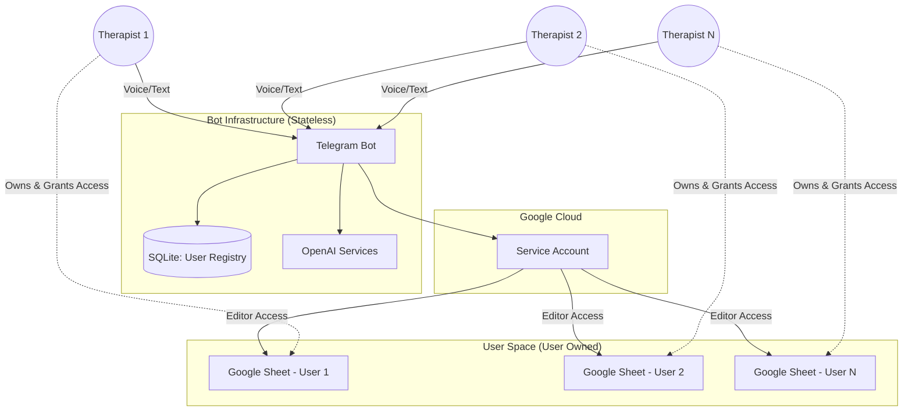
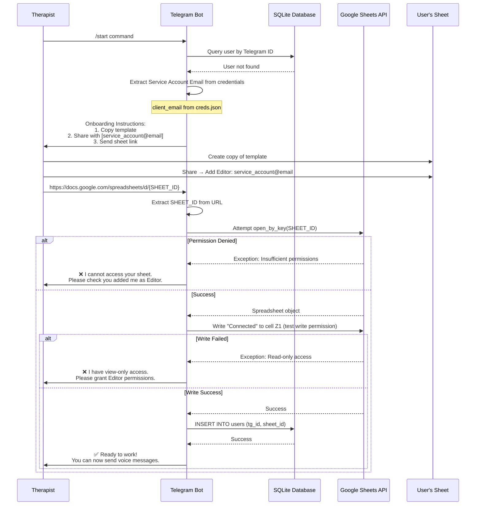
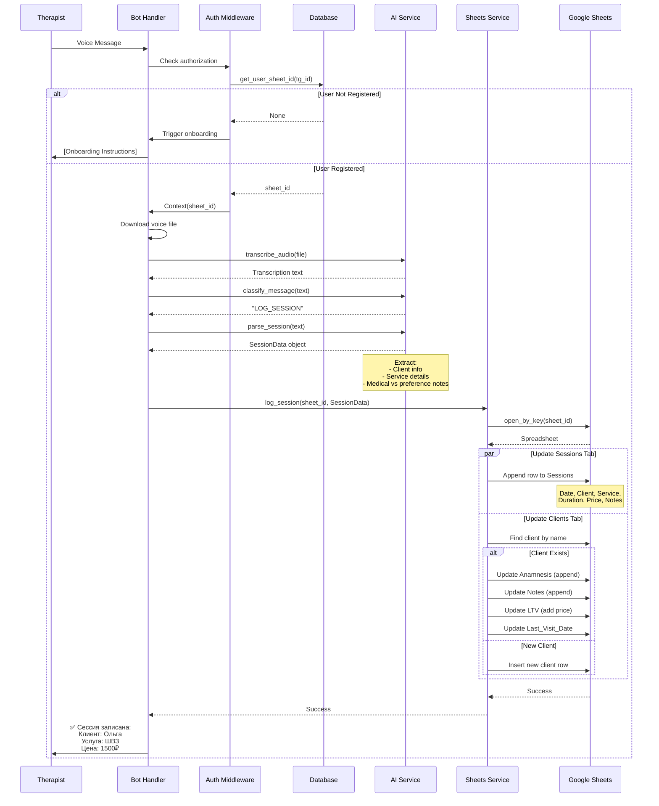
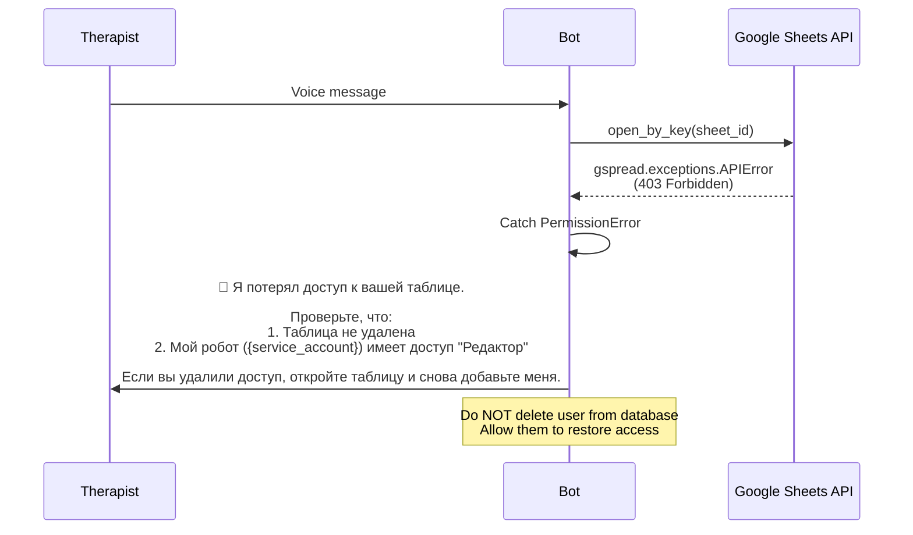
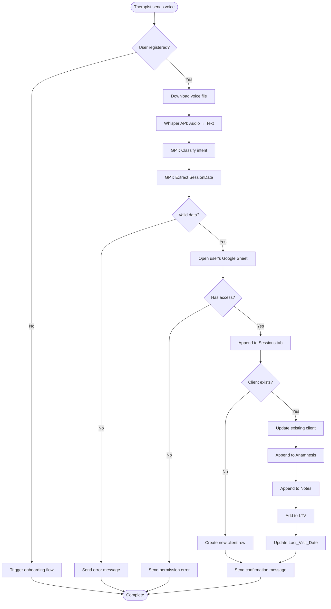
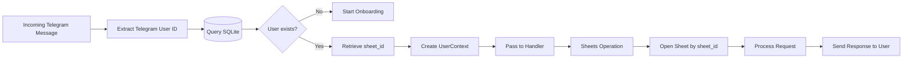

# Multi-User SaaS Refactor: Massage Therapist CRM

## Executive Summary

This design document outlines the architectural transformation of an existing single-user warehouse inventory bot into a multi-tenant SaaS CRM system for massage therapists. The refactor shifts from a centralized data model to a decentralized architecture where each user maintains ownership of their data through personal Google Sheets.

## Product Philosophy

### Paradigm Shift

The refactor represents a fundamental architectural change:

- **Old Model**: Single Owner → One Bot → One Admin → One Sheet
- **New Model**: Multi-Tenant → One Bot → N Users → N Sheets (User Owned)

### Core Principles

| Principle | Description | Rationale |
|-----------|-------------|-----------|
| **Data Sovereignty** | Users own and control their data storage | Privacy compliance, user trust, reduced liability |
| **Decentralized Architecture** | Bot acts as interface, not data store | Scalability, zero data migration, reduced infrastructure costs |
| **Privacy by Design** | No medical data persists in bot infrastructure | GDPR/HIPAA alignment, ethical responsibility |
| **Service Account Model** | Users grant access to bot's service account | Standard OAuth pattern, revocable permissions |

## Domain Model Transformation

### Conceptual Mapping

The business domain changes from retail inventory management to healthcare service delivery:

| Old Concept | New Concept | Semantic Shift |
|-------------|-------------|----------------|
| Inventory (Products) | Services (Treatment Types) | From physical goods to service catalog |
| Supply (Restock) | Add Service | From receiving shipments to defining offerings |
| Sale | Session (Visit) | From transaction to therapeutic encounter |
| Customer Notes | Anamnesis + Session Notes | From preferences to medical history |
| Transaction Log | Session Log | From financial record to clinical documentation |

### Data Ownership Architecture


```mermaid
graph TB
    subgraph "User Space (User Owned)"
        Sheet1[Google Sheet - User 1]
        Sheet2[Google Sheet - User 2]
        SheetN[Google Sheet - User N]
    end
    
    subgraph "Bot Infrastructure (Stateless)"
        Bot[Telegram Bot]
        DB[(SQLite: User Registry)]
        AI[OpenAI Services]
    end
    
    subgraph "Google Cloud"
        SA[Service Account]
    end
    
    User1((Therapist 1)) -->|Voice/Text| Bot
    User2((Therapist 2)) -->|Voice/Text| Bot
    UserN((Therapist N)) -->|Voice/Text| Bot
    
    Bot --> DB
    Bot --> AI
    Bot --> SA
    
    SA -->|Editor Access| Sheet1
    SA -->|Editor Access| Sheet2
    SA -->|Editor Access| SheetN
    
    User1 -.->|Owns & Grants Access| Sheet1
    User2 -.->|Owns & Grants Access| Sheet2
    UserN -.->|Owns & Grants Access| SheetN
```

## System Architecture

### Multi-Tenancy Strategy

The system implements **tenant isolation through data partitioning** rather than schema separation. Each user's data resides in a separate Google Sheet identified by a unique spreadsheet ID.

**Tenant Identification Flow**:
1. User sends message to bot (Telegram User ID extracted)
2. Bot queries local registry database
3. Database returns user's Google Sheet ID
4. Bot establishes session context with Sheet ID
5. All operations scoped to that specific sheet

### State Management

**Stateful Components**:
- Local SQLite database (users.db): Maps Telegram ID → Sheet ID
- Google Sheets (user-owned): Persistent storage of all clinical data

**Stateless Components**:
- Bot handlers: No session state between requests
- AI service: Pure function transformations
- Sheet service: Dynamically scoped to user context

## Data Architecture

### Local Database Schema

The bot maintains a minimal user registry to enable multi-tenancy:

**Table: `users`**

| Column | Type | Constraints | Purpose |
|--------|------|-------------|---------|
| tg_id | INTEGER | PRIMARY KEY | Telegram User ID (unique identifier) |
| sheet_id | TEXT | NOT NULL, UNIQUE | Google Spreadsheet ID (extracted from user's sheet URL) |
| is_active | BOOLEAN | DEFAULT TRUE | Soft delete flag for account deactivation |
| created_at | TIMESTAMP | DEFAULT CURRENT_TIMESTAMP | Registration audit trail |
| last_active_at | TIMESTAMP | NULL | Last interaction timestamp for analytics |

**Indexing Strategy**:
- Primary index on `tg_id` for fast user lookup during message handling
- Unique constraint on `sheet_id` prevents multiple accounts sharing same sheet
- Composite index on `(is_active, last_active_at)` for user lifecycle queries

**Data Retention Policy**:
- User records persist indefinitely (soft delete only)
- No personal or medical data stored locally
- Compliance: Only Telegram ID (pseudonymous) and sheet reference stored

### Google Sheets Template Structure

Each user creates their own Google Sheet from a public template. The bot expects a standardized structure with three tabs.

#### Tab 1: Clients (CRM Core)

**Purpose**: Central client registry with medical history and relationship data

| Column | Data Type | Description | Privacy Level |
|--------|-----------|-------------|---------------|
| Name | Text | Client full name | PII |
| Phone_Contact | Text | Phone number or messaging contact | PII |
| Anamnesis | Text (Multi-line) | Medical history, complaints, contraindications, pain points | Sensitive Medical |
| Notes | Text (Multi-line) | Non-medical preferences (e.g., massage pressure, oil preferences) | Low |
| LTV | Decimal | Lifetime Total Value (cumulative revenue from client) | Financial |
| Last_Visit_Date | Date (YYYY-MM-DD) | Date of most recent session | Audit |
| Next_Reminder | Date (YYYY-MM-DD) | Scheduled follow-up or reminder date | Operational |

**Data Flow Behavior**:
- **Anamnesis**: Append-only. Each session adds new medical notes with timestamp prefix
- **Notes**: Append-only. Preferences accumulate over time
- **LTV**: Cumulative calculation updated after each paid session
- **Last_Visit_Date**: Overwrite with most recent session date
- **Next_Reminder**: Overwrite when new appointment scheduled

**Example Record**:

| Name | Anamnesis | Notes | LTV | Last_Visit_Date |
|------|-----------|-------|-----|-----------------|
| Ольга | 25.10: Жалобы на шею, остеохондроз | Просит масло без запаха | 1500 | 2023-10-25 |

#### Tab 2: Sessions (Financial & Clinical Log)

**Purpose**: Immutable audit trail of all therapeutic encounters

| Column | Data Type | Description | Compliance |
|--------|-----------|-------------|------------|
| Date | Date (YYYY-MM-DD) | Session date | Audit |
| Client_Name | Text | Client identifier (foreign key to Clients tab) | PII |
| Service_Type | Text | Type of massage/treatment performed | Clinical |
| Duration | Integer | Session length in minutes | Clinical |
| Price | Decimal | Amount charged for session | Financial |
| Session_Notes | Text | Technical notes about session (techniques used, areas treated) | Clinical |

**Immutability Principle**: Rows are append-only. No updates or deletes (audit trail integrity).

**Example Record**:

| Date | Client_Name | Service_Type | Duration | Price | Session_Notes |
|------|-------------|--------------|----------|-------|---------------|
| 2023-10-25 | Ольга | ШВЗ | 30 | 1500 | Сделали 30 мин. Клиент доволен. |

#### Tab 3: Services (Price List)

**Purpose**: Service catalog and default pricing configuration

| Column | Data Type | Description | Usage |
|--------|-----------|-------------|-------|
| Service_Name | Text | Name of massage/treatment type (e.g., "Массаж спины", "ШВЗ") | Reference |
| Default_Price | Decimal | Standard price for this service | Auto-fill |
| Default_Duration | Integer | Typical session length in minutes | Auto-fill |

**Purpose**: Provides AI context for service type recognition and default values for price/duration if not specified in voice message.

## Functional Workflows

### User Onboarding Flow

**Objective**: Securely connect a new user's Google Sheet to the bot without requiring technical expertise.


```mermaid
sequenceDiagram
    participant User as Therapist
    participant Bot as Telegram Bot
    participant DB as SQLite Database
    participant GS as Google Sheets API
    participant Sheet as User's Sheet

    User->>Bot: /start command
    Bot->>DB: Query user by Telegram ID
    DB-->>Bot: User not found
    
    Bot->>Bot: Extract Service Account Email from credentials
    Note over Bot: client_email from creds.json
    
    Bot->>User: Onboarding Instructions:<br/>1. Copy template<br/>2. Share with [service_account@email]<br/>3. Send sheet link
    
    User->>Sheet: Create copy of template
    User->>Sheet: Share → Add Editor: service_account@email
    User->>Bot: https://docs.google.com/spreadsheets/d/{SHEET_ID}
    
    Bot->>Bot: Extract SHEET_ID from URL
    Bot->>GS: Attempt open_by_key(SHEET_ID)
    
    alt Permission Denied
        GS-->>Bot: Exception: Insufficient permissions
        Bot->>User: ❌ I cannot access your sheet.<br/>Please check you added me as Editor.
    else Success
        GS-->>Bot: Spreadsheet object
        Bot->>GS: Write "Connected" to cell Z1 (test write permission)
        
        alt Write Failed
            GS-->>Bot: Exception: Read-only access
            Bot->>User: ❌ I have view-only access.<br/>Please grant Editor permissions.
        else Write Success
            GS-->>Bot: Success
            Bot->>DB: INSERT INTO users (tg_id, sheet_id)
            DB-->>Bot: Success
            Bot->>User: ✅ Ready to work!<br/>You can now send voice messages.
        end
    end
```

**Onboarding Message Template**:

```
Привет! Я твой ИИ-помощник для управления клиентами массажа.

Чтобы начать:

📋 Шаг 1: Скопируй этот шаблон себе
[Ссылка на публичный Read-Only шаблон]

🔑 Шаг 2: Нажми "Настройки доступа" (кнопка "Share") и добавь моего робота как Редактора (Editor):
{service_account_email}

📤 Шаг 3: Пришли мне ссылку на твою таблицу
```

**Validation Logic**:
- URL parsing: Extract `{SHEET_ID}` from URLs in formats:
  - `https://docs.google.com/spreadsheets/d/{SHEET_ID}/edit`
  - `https://docs.google.com/spreadsheets/d/{SHEET_ID}`
- Reject non-Google Sheets URLs
- Test write access before confirming registration
- Store normalized Sheet ID (just the ID part, not full URL)

### Session Logging Flow (Core Use Case)

**Scenario**: Therapist completes a massage session and records it via voice message.

**Example Voice Input**:
> "Приходила новенькая, Ольга, жалуется на шею и остеохондроз. Сделали ШВЗ 30 минут за 1500. Ей понравилось, но просила в следующий раз масло без запаха."

**Expected Data Extraction**:

| Field | Extracted Value | Category |
|-------|----------------|----------|
| Client Name | Ольга | Identity |
| Service Type | ШВЗ (Массаж шейно-воротниковой зоны) | Service |
| Duration | 30 минут | Session Detail |
| Price | 1500 | Financial |
| Medical Complaints | Жалобы на шею, остеохондроз | Anamnesis (Medical) |
| Session Outcome | Ей понравилось | Session Notes (Technical) |
| Future Preference | Просила масло без запаха | Notes (Non-Medical) |

**Processing Flow**:


```mermaid
sequenceDiagram
    participant User as Therapist
    participant Bot as Bot Handler
    participant Auth as Auth Middleware
    participant DB as Database
    participant AI as AI Service
    participant Sheet as Sheets Service
    participant GS as Google Sheets

    User->>Bot: Voice Message
    Bot->>Auth: Check authorization
    Auth->>DB: get_user_sheet_id(tg_id)
    
    alt User Not Registered
        DB-->>Auth: None
        Auth->>Bot: Trigger onboarding
        Bot->>User: [Onboarding Instructions]
    else User Registered
        DB-->>Auth: sheet_id
        Auth->>Bot: Context(sheet_id)
        
        Bot->>Bot: Download voice file
        Bot->>AI: transcribe_audio(file)
        AI-->>Bot: Transcription text
        
        Bot->>AI: classify_message(text)
        AI-->>Bot: "LOG_SESSION"
        
        Bot->>AI: parse_session(text)
        AI-->>Bot: SessionData object
        
        Note over AI: Extract:<br/>- Client info<br/>- Service details<br/>- Medical vs preference notes
        
        Bot->>Sheet: log_session(sheet_id, SessionData)
        
        Sheet->>GS: open_by_key(sheet_id)
        GS-->>Sheet: Spreadsheet
        
        par Update Sessions Tab
            Sheet->>GS: Append row to Sessions
            Note over GS: Date, Client, Service,<br/>Duration, Price, Notes
        and Update Clients Tab
            Sheet->>GS: Find client by name
            alt Client Exists
                Sheet->>GS: Update Anamnesis (append)
                Sheet->>GS: Update Notes (append)
                Sheet->>GS: Update LTV (add price)
                Sheet->>GS: Update Last_Visit_Date
            else New Client
                Sheet->>GS: Insert new client row
            end
        end
        
        GS-->>Sheet: Success
        Sheet-->>Bot: Success
        
        Bot->>User: ✅ Сессия записана:<br/>Клиент: Ольга<br/>Услуга: ШВЗ<br/>Цена: 1500₽
    end
```

**Data Writes to Google Sheets**:

**Sessions Tab** (Append):
```
| Date       | Client | Service | Duration | Price | Session_Notes                    |
|------------|--------|---------|----------|-------|----------------------------------|
| 2023-10-25 | Ольга  | ШВЗ     | 30       | 1500  | Сделали 30 мин. Клиент доволен. |
```

**Clients Tab** (Upsert):

For new client:
```
| Name  | Anamnesis                          | Notes                      | LTV  | Last_Visit_Date |
|-------|------------------------------------|----------------------------|------|-----------------|
| Ольга | 25.10: Жалобы на шею, остеохондроз | Просит масло без запаха   | 1500 | 2023-10-25      |
```

For existing client (append to Anamnesis and Notes):
```
Anamnesis (before): "15.10: Боль в пояснице"
Anamnesis (after):  "15.10: Боль в пояснице\n25.10: Жалобы на шею, остеохондроз"

LTV (before): 3000
LTV (after):  4500
```

### Client Lookup Flow

**Use Case**: Therapist wants to review a client's history before a session.

**Command**: `/client Ольга`

**Response Format**:
```
📋 Информация о клиенте

👤 Имя: Ольга
📱 Контакт: +7 (XXX) XXX-XX-XX

🏥 Анамнез:
15.10: Боль в пояснице
25.10: Жалобы на шею, остеохондроз

📝 Заметки:
Просит масло без запаха
Предпочитает вечерние сеансы

💰 LTV: 4500₽
📅 Последний визит: 2023-10-25

📊 История сеансов:
- 25.10: ШВЗ (1500₽)
- 15.10: Массаж спины (3000₽)
```

**Data Flow**:
1. Extract client name from command
2. Query user's sheet_id from database
3. Open Google Sheet by sheet_id
4. Search Clients tab for matching name (case-insensitive)
5. Retrieve all columns for that client
6. Query Sessions tab for all sessions with matching client name
7. Format and return aggregated data

### Permission Error Handling Flow

**Scenario**: User revokes bot's access to their Google Sheet.


```mermaid
sequenceDiagram
    participant User as Therapist
    participant Bot as Bot
    participant GS as Google Sheets API

    User->>Bot: Voice message
    Bot->>GS: open_by_key(sheet_id)
    GS-->>Bot: gspread.exceptions.APIError<br/>(403 Forbidden)
    
    Bot->>Bot: Catch PermissionError
    Bot->>User: 🚫 Я потерял доступ к вашей таблице.<br/><br/>Проверьте, что:<br/>1. Таблица не удалена<br/>2. Мой робот ({service_account}) имеет доступ "Редактор"<br/><br/>Если вы удалили доступ, откройте таблицу и снова добавьте меня.
    
    Note over Bot: Do NOT delete user from database<br/>Allow them to restore access
```

## AI Service Architecture

### Intent Classification

**Purpose**: Determine the nature of the therapist's message to route to appropriate handler.

**Classification Categories**:

| Intent | Indicators | Handler |
|--------|-----------|---------|
| LOG_SESSION | Contains: client name, service type, price, medical complaints | Session logging flow |
| CLIENT_UPDATE | Contains: client name + non-medical notes WITHOUT sale indicators | Update client preferences |
| CONSULTATION | Questions about client history, contains "кто", "когда", "сколько" | Client lookup |
| ADD_SERVICE | Adding new service to catalog | Service management (future) |

**System Prompt for Classification**:
```
You are an expert assistant for massage therapists. Classify the therapist's message intent:

- LOG_SESSION: Recording a completed session (contains client, service, price, complaints)
- CLIENT_UPDATE: Adding notes about client WITHOUT session/payment details
- CONSULTATION: Asking about client history or looking up information
- ADD_SERVICE: Defining a new service type in their catalog

Respond with only the intent name.
```

### Session Data Extraction

**Pydantic Schema**:

```
SessionData:
  - client_name: str (required)
  - service_name: str (required, must match Services tab if possible)
  - price: float (required)
  - duration: int (optional, minutes)
  - medical_notes: str (nullable, complaints/contraindications/pain)
  - session_notes: str (nullable, technical details of treatment)
  - preference_notes: str (nullable, non-medical preferences)
  - next_appointment_date: date (nullable, YYYY-MM-DD)
```

**Critical Distinction**: Medical vs. Preference Data

The AI must classify text into two categories:

**Medical Notes (→ Anamnesis column)**:
- Complaints: "болит шея", "остеохондроз", "мигрени"
- Pain descriptions: "острая боль", "тупая боль", "онемение"
- Contraindications: "аллергия", "высокое давление", "беременность"
- Diagnostic observations: "триггерные точки", "спазм мышц"

**Preference Notes (→ Notes column)**:
- Session preferences: "масло без запаха", "сильное давление"
- Scheduling: "предпочитает вечерние сеансы"
- Communication: "напомнить за день", "пишет в Telegram"
- General: "любит спокойную музыку"

**System Prompt Extract**:
```
Extract data from a massage therapist's voice note about a completed session.

CRITICAL DISTINCTION:
- medical_notes: Medical complaints, pain, health conditions, contraindications
  Examples: "болит шея", "остеохондроз", "триггерные точки"
  
- preference_notes: Non-medical preferences about session delivery
  Examples: "масло без запаха", "сильное давление", "вечерние сеансы"
  
- session_notes: Technical details of THIS session's treatment
  Examples: "проработали триггеры", "использовали масло лаванды", "30 минут"

RULES:
- client_name: Extract full name (capitalize properly)
- service_name: Normalize common abbreviations (ШВЗ → Массаж шейно-воротниковой зоны)
- price: REQUIRED. Extract numeric value.
- duration: Extract minutes if mentioned, else null
- next_appointment_date: Convert relative dates ("во вторник", "через неделю") to YYYY-MM-DD
```

**Example Extraction**:

Input: "Приходила новенькая, Ольга, жалуется на шею и остеохондроз. Сделали ШВЗ 30 минут за 1500. Ей понравилось, но просила в следующий раз масло без запаха."

Output:
```json
{
  "client_name": "Ольга",
  "service_name": "Массаж шейно-воротниковой зоны",
  "price": 1500,
  "duration": 30,
  "medical_notes": "Жалобы на шею, остеохондроз",
  "session_notes": "Клиент доволен",
  "preference_notes": "Просит масло без запаха",
  "next_appointment_date": null
}
```

### Fuzzy Service Name Matching

**Problem**: Users may use abbreviations or colloquial terms.

**Solution**: AI should normalize to canonical service names from Services tab.

**Matching Strategy**:
1. Fetch all service names from user's Services tab
2. Pass as context to AI extraction prompt
3. AI selects closest match or uses verbatim if no match

**Example**:
- User says: "ШВЗ"
- Services tab contains: "Массаж шейно-воротниковой зоны"
- AI normalizes: "Массаж шейно-воротниковой зоны"

## Sheets Service Refactor

### Multi-Tenant Method Signatures

**Critical Change**: All methods must accept `sheet_id` as first parameter to enable per-user scoping.

**Old (Single-Tenant)**:
```
async def add_session(self, session_data: SessionData)
```

**New (Multi-Tenant)**:
```
async def add_session(self, sheet_id: str, session_data: SessionData)
```

### Dynamic Spreadsheet Initialization

**Old Pattern** (Global Spreadsheet):
```
class SheetsService:
    def __init__(self):
        self.spreadsheet = None  # Initialized once
    
    async def initialize(self):
        self.spreadsheet = await agc.open_by_key(GOOGLE_SHEET_KEY)
```

**New Pattern** (Per-Request Spreadsheet):
```
class SheetsService:
    def __init__(self):
        self.agcm = None  # Client manager (singleton)
    
    async def initialize(self):
        self.agcm = gspread_asyncio.AsyncioGspreadClientManager(self._get_creds)
    
    async def _get_spreadsheet(self, sheet_id: str):
        agc = await self.agcm.authorize()
        return await agc.open_by_key(sheet_id)
```

**Rationale**: 
- `agcm` (AsyncioGspreadClientManager) remains global for credential management
- `spreadsheet` object is fetched dynamically per request based on user context
- Enables concurrent operations on different users' sheets

### Lock Strategy Refactor

**Old Pattern** (Global Lock):
```
async with self.lock:  # Blocks ALL users
    await self._write_to_sheet()
```

**New Pattern** (No Global Lock):
```
# No lock needed - different sheets can be written concurrently
await self._write_to_sheet(sheet_id)
```

**Justification**:
- In single-tenant: Global lock prevented race conditions on ONE sheet
- In multi-tenant: Each user has SEPARATE sheet
- Google Sheets API handles concurrent writes to SAME sheet via internal queuing
- Per-user locks add complexity without benefit (users rarely conflict with themselves)
- **Decision**: Remove global lock, rely on Google Sheets API concurrency control

**Exception**: If implementing caching layer in future, use per-sheet locks via dictionary:
```python
self.sheet_locks = {}  # {sheet_id: asyncio.Lock()}

async def _get_lock(self, sheet_id: str):
    if sheet_id not in self.sheet_locks:
        self.sheet_locks[sheet_id] = asyncio.Lock()
    return self.sheet_locks[sheet_id]
```

### Core Method Transformations

#### log_session (Replaces update_inventory + upsert_client)

**Signature**:
```
async def log_session(
    self, 
    sheet_id: str, 
    session_data: SessionData
) -> None
```

**Responsibilities**:
1. Open spreadsheet by `sheet_id`
2. Append row to Sessions tab (immutable log)
3. Upsert client in Clients tab:
   - If new: Create client record
   - If existing: 
     - Append to Anamnesis (medical_notes)
     - Append to Notes (preference_notes)
     - Add to LTV (cumulative)
     - Update Last_Visit_Date (overwrite)
     - Update Next_Reminder if appointment scheduled

**Anamnesis Append Logic**:
```
existing_anamnesis = "15.10: Боль в пояснице"
new_medical_notes = "Жалобы на шею, остеохондроз"
current_date = "25.10"

updated_anamnesis = f"{existing_anamnesis}\n{current_date}: {new_medical_notes}"
Result: "15.10: Боль в пояснице\n25.10: Жалобы на шею, остеохондроз"
```

**Error Handling**:
- If sheet_id invalid: Raise `ValueError("Invalid sheet ID")`
- If permission denied: Raise `PermissionError("Access revoked")`
- If Sessions/Clients tabs missing: Auto-create with headers

#### get_client (Enhanced for Medical Data)

**Signature**:
```
async def get_client(
    self, 
    sheet_id: str, 
    client_name: str
) -> Optional[ClientRecord]
```

**Returns**:
```
ClientRecord:
  - name: str
  - phone_contact: str
  - anamnesis: str (formatted with line breaks)
  - notes: str
  - ltv: float
  - last_visit_date: str (YYYY-MM-DD)
  - next_reminder: str (YYYY-MM-DD)
  - session_history: List[SessionRecord]  # From Sessions tab
```

**Join Logic**:
1. Query Clients tab for client by name
2. Query Sessions tab for all sessions matching client_name
3. Aggregate session_history ordered by date descending
4. Calculate LTV verification (sum of session prices should match LTV column)

#### validate_and_connect (Onboarding Helper)

**Signature**:
```
async def validate_and_connect(
    self, 
    sheet_url: str
) -> tuple[bool, str, Optional[str]]
```

**Returns**: `(success: bool, message: str, sheet_id: Optional[str])`

**Steps**:
1. Parse URL to extract sheet_id (regex or string split)
2. Attempt `agc.open_by_key(sheet_id)`
3. If succeeds: Write test value to cell Z1
4. If write succeeds: Return `(True, "Connected successfully", sheet_id)`
5. If read-only: Return `(False, "Need Editor access", None)`
6. If permission denied: Return `(False, "Cannot access sheet", None)`

**URL Parsing Patterns**:
```
https://docs.google.com/spreadsheets/d/{SHEET_ID}/edit#gid=0
https://docs.google.com/spreadsheets/d/{SHEET_ID}/edit
https://docs.google.com/spreadsheets/d/{SHEET_ID}

Extract: {SHEET_ID} via regex or split on '/d/' and '/edit'
```

## Bot Handler Refactor

### Authorization Middleware Transformation

**Old Pattern** (Single User Check):
```python
def is_authorized(message: Message) -> bool:
    return message.from_user.id == Config.get_allowed_user_id()
```

**New Pattern** (Multi-User Registration Check):
```python
async def get_user_context(message: Message) -> Optional[UserContext]:
    tg_id = message.from_user.id
    sheet_id = await db_service.get_user_sheet_id(tg_id)
    
    if sheet_id is None:
        return None  # Trigger onboarding
    
    return UserContext(tg_id=tg_id, sheet_id=sheet_id)
```

**Integration**:
```python
@dp.message(F.voice)
async def handle_voice(message: Message):
    context = await get_user_context(message)
    
    if context is None:
        await trigger_onboarding(message)
        return
    
    # Process with context.sheet_id
    await process_voice_message(message, context.sheet_id)
```

### Handler Flow Transformation

**Old Flow** (Sale Handler):
```python
async def handle_sale(message, transcription):
    sale_data = await ai_service.parse_sale(transcription)
    await sheets_service.update_inventory(sale_data.items, "Sale")
    await sheets_service.upsert_client(client_data)
```

**New Flow** (Session Handler):
```python
async def handle_session(message, transcription, sheet_id: str):
    session_data = await ai_service.parse_session(transcription)
    await sheets_service.log_session(sheet_id, session_data)
    await send_confirmation(message, session_data)
```

**Key Changes**:
- Remove inventory management logic (no stock tracking for services)
- Combine transaction logging with client update (single atomic operation)
- Pass `sheet_id` to all sheet operations
- Medical data never logged to console (privacy)

### State Machine for Onboarding

**States**:
1. `UNREGISTERED`: User not in database
2. `AWAITING_SHEET_URL`: User received instructions, waiting for sheet link
3. `REGISTERED`: User connected, ready to use

**Implementation** (Simplified):
```python
# Store temporary state in memory (or use aiogram FSM)
onboarding_states = {}  # {tg_id: OnboardingState}

@dp.message(Command("start"))
async def cmd_start(message: Message):
    tg_id = message.from_user.id
    user_exists = await db_service.user_exists(tg_id)
    
    if user_exists:
        await message.answer("Добро пожаловать! Отправьте голосовое сообщение.")
    else:
        await start_onboarding(message)

async def start_onboarding(message: Message):
    tg_id = message.from_user.id
    onboarding_states[tg_id] = "AWAITING_SHEET_URL"
    
    service_email = Config.get_service_account_email()
    
    await message.answer(
        f"Привет! Я твой ИИ-помощник.\n\n"
        f"Шаг 1: Скопируй шаблон: {TEMPLATE_URL}\n"
        f"Шаг 2: Добавь редактора: {service_email}\n"
        f"Шаг 3: Пришли мне ссылку"
    )

@dp.message(F.text)
async def handle_text(message: Message):
    tg_id = message.from_user.id
    
    if onboarding_states.get(tg_id) == "AWAITING_SHEET_URL":
        await process_sheet_url(message)
    else:
        # Regular text message handling
        pass

async def process_sheet_url(message: Message):
    tg_id = message.from_user.id
    url = message.text
    
    success, msg, sheet_id = await sheets_service.validate_and_connect(url)
    
    if success:
        await db_service.add_user(tg_id, sheet_id)
        onboarding_states.pop(tg_id, None)
        await message.answer("✅ Готово! Можешь отправлять голосовые.")
    else:
        await message.answer(f"❌ {msg}\nПопробуй еще раз.")
```

### Privacy-Compliant Logging

**Old Logging**:
```python
logger.info(f"Transcription: {transcription}")
logger.info(f"Parsed sale data: {sale_data.client.name} - {sale_data.items}")
```

**New Logging** (Privacy-Preserving):
```python
logger.info(f"User <TG_ID:{tg_id}> sent voice message")
logger.info(f"User <TG_ID:{tg_id}> logged a session")  # No client names
logger.info(f"User <TG_ID:{tg_id}> lookup client")  # No query details

# Exception: Log transcription length, NOT content
logger.info(f"Transcription length: {len(transcription)} chars")
```

**Rationale**:
- Medical data (anamnesis, client names) must NOT appear in logs
- Telegram ID is pseudonymous (acceptable for debugging)
- Operation type (session/lookup) is acceptable metadata

## Configuration Refactor

### Environment Variables

**Removed**:
- `ALLOWED_USER_ID` (no longer single-user)
- `GOOGLE_SHEET_KEY` (each user has own sheet)

**Added**:
- `TEMPLATE_SHEET_URL`: Public read-only template link
- `DATABASE_PATH`: Path to SQLite file (default: `./users.db`)

**Retained**:
- `BOT_TOKEN`: Telegram bot token
- `OPENAI_API_KEY`: OpenAI API key
- `GOOGLE_SHEETS_CREDENTIALS_BASE64`: Service account credentials
- `TIMEZONE`: Default timezone for date handling

### Service Account Email Extraction

**Purpose**: Display service account email in onboarding instructions.

**Implementation**:
```python
@classmethod
def get_service_account_email(cls) -> str:
    """Extract client_email from decoded credentials"""
    creds = cls.get_google_credentials()
    return creds.get("client_email", "service-account@project.iam.gserviceaccount.com")
```

**Usage**:
```python
email = Config.get_service_account_email()
onboarding_message = f"Добавь редактора: {email}"
```

## Database Service Implementation

### Module Structure

**File**: `database.py`

**Responsibilities**:
- SQLite connection management (async via aiosqlite)
- User CRUD operations
- Database initialization and migration

### Core Methods

#### init_db

**Signature**:
```
async def init_db(db_path: str = "./users.db") -> None
```

**Purpose**: Create database and schema if not exists.

**SQL**:
```sql
CREATE TABLE IF NOT EXISTS users (
    tg_id INTEGER PRIMARY KEY,
    sheet_id TEXT NOT NULL UNIQUE,
    is_active BOOLEAN DEFAULT TRUE,
    created_at TIMESTAMP DEFAULT CURRENT_TIMESTAMP,
    last_active_at TIMESTAMP
);

CREATE INDEX IF NOT EXISTS idx_active_users ON users(is_active, last_active_at);
```

#### add_user

**Signature**:
```
async def add_user(tg_id: int, sheet_id: str) -> bool
```

**Purpose**: Register new user or update sheet_id if exists.

**SQL**:
```sql
INSERT INTO users (tg_id, sheet_id, created_at) 
VALUES (?, ?, CURRENT_TIMESTAMP)
ON CONFLICT(tg_id) DO UPDATE SET 
    sheet_id = excluded.sheet_id,
    is_active = TRUE;
```

**Returns**: `True` if successful, `False` on error.

#### get_user_sheet_id

**Signature**:
```
async def get_user_sheet_id(tg_id: int) -> Optional[str]
```

**Purpose**: Retrieve user's sheet_id for request context.

**SQL**:
```sql
SELECT sheet_id FROM users WHERE tg_id = ? AND is_active = TRUE;
```

**Returns**: `sheet_id` string or `None` if not found/inactive.

#### update_last_active

**Signature**:
```
async def update_last_active(tg_id: int) -> None
```

**Purpose**: Track user activity for analytics.

**SQL**:
```sql
UPDATE users SET last_active_at = CURRENT_TIMESTAMP WHERE tg_id = ?;
```

#### deactivate_user

**Signature**:
```
async def deactivate_user(tg_id: int) -> bool
```

**Purpose**: Soft delete user (retain data for audit).

**SQL**:
```sql
UPDATE users SET is_active = FALSE WHERE tg_id = ?;
```

### Singleton Pattern

**Implementation**:
```python
class DatabaseService:
    _instance = None
    
    def __new__(cls):
        if cls._instance is None:
            cls._instance = super().__new__(cls)
            cls._instance.db_path = None
            cls._instance._initialized = False
        return cls._instance
    
    async def initialize(self, db_path: str = "./users.db"):
        if self._initialized:
            return
        self.db_path = db_path
        await self.init_db()
        self._initialized = True

# Global instance
db_service = DatabaseService()
```

## Security & Privacy Considerations

### Data Protection Principles

| Principle | Implementation | Compliance Impact |
|-----------|----------------|-------------------|
| **Data Minimization** | Bot stores only Telegram ID + Sheet ID, no medical data | GDPR Art. 5(1)(c) |
| **Purpose Limitation** | Sheet ID used solely for routing requests to correct sheet | GDPR Art. 5(1)(b) |
| **Storage Limitation** | Medical data never cached, processed in-memory only | GDPR Art. 5(1)(e) |
| **Confidentiality** | Service account credentials in env vars, never logged | ISO 27001 |
| **User Control** | Users can revoke access anytime via Google Share settings | GDPR Art. 7(3) |

### Threat Model

**Threat**: Unauthorized access to user's medical data via bot compromise.

**Mitigation**:
1. No medical data stored in bot infrastructure (attacker gets only Telegram ID mappings)
2. Service account has Editor access only (cannot share sheets further)
3. User can revoke access immediately via Google UI

**Threat**: Bot processes data for malicious user's sheet.

**Mitigation**:
1. Each user can only access their own sheet (no cross-tenant queries)
2. Telegram ID provides pseudonymous authentication
3. No admin/superuser functionality (all users equal privilege)

**Threat**: Logs expose medical information.

**Mitigation**:
1. Privacy-compliant logging (no client names, complaints, or anamnesis)
2. Log only pseudonymous identifiers (Telegram ID, sheet ID)
3. Example: "User <TG_ID:12345> logged session" instead of "Logged session for Ольга with neck pain"

### GDPR Compliance Checklist

| Requirement | Status | Implementation |
|-------------|--------|----------------|
| Right to Access (Art. 15) | ✅ | User accesses data directly in their own Google Sheet |
| Right to Erasure (Art. 17) | ✅ | User deletes their Google Sheet; bot record can be deactivated |
| Right to Portability (Art. 20) | ✅ | Data in Google Sheets (standard format, user-exportable) |
| Data Processing Agreement | ⚠️ | User implicitly consents by sharing sheet; explicit ToS recommended |
| Breach Notification (Art. 33) | ✅ | No sensitive data in bot → low breach risk; sheet breaches are Google's responsibility |

**Recommendation**: Add `/delete_account` command that:
1. Deactivates user in database (`is_active = FALSE`)
2. Does NOT delete their Google Sheet (user owns it)
3. Informs user they must manually delete sheet if desired

## Error Handling Strategy

### Error Categories

| Error Type | Example | User Message | Technical Action |
|------------|---------|--------------|------------------|
| **Permission Error** | User revoked access | "🚫 Я потерял доступ к таблице. Проверьте настройки." | Log warning, do NOT delete user |
| **Invalid Sheet Structure** | Missing Clients tab | "❌ Ваша таблица повреждена. Скопируйте шаблон заново." | Attempt auto-repair (create missing tabs) |
| **AI Extraction Failure** | Cannot parse voice | "🤷 Не удалось распознать. Попробуйте еще раз четче." | Log for AI prompt improvement |
| **Network Error** | Google API timeout | "⏳ Ошибка связи. Повторите через минуту." | Retry with exponential backoff |
| **Invalid Input** | Non-Google Sheets URL | "❌ Это не ссылка на Google Таблицу." | Provide URL format example |

### Graceful Degradation

**Scenario**: Google Sheets API temporarily unavailable.

**Strategy**:
1. Catch `gspread.exceptions.APIError`
2. If HTTP 503 (Service Unavailable): Queue request for retry (or ask user to retry)
3. If HTTP 429 (Rate Limit): Backoff and inform user "Слишком много запросов, подождите 30 секунд"
4. Do NOT lose transcription data (store in memory for 5 minutes for retry)

**Implementation Sketch**:
```python
try:
    await sheets_service.log_session(sheet_id, session_data)
except gspread.exceptions.APIError as e:
    if e.response.status_code == 503:
        await message.answer("⏳ Google Таблицы временно недоступны. Повторите через минуту.")
    elif e.response.status_code == 429:
        await message.answer("⏱️ Слишком много запросов. Подождите 30 секунд.")
    else:
        raise  # Unexpected API error
```

## Timezone Handling

### Problem Statement

Massage therapists work in local time. Session dates must reflect the therapist's timezone, not server UTC.

### Solution Architecture

**Configuration**:
- Each user has implicit timezone from `TIMEZONE` env var (system-wide default)
- Future enhancement: Store per-user timezone in database

**Date Formatting**:
```python
import pytz
from datetime import datetime

def get_current_date_for_user(timezone_str: str = Config.TIMEZONE) -> str:
    """Get current date in user's timezone"""
    tz = pytz.timezone(timezone_str)
    now = datetime.now(tz)
    return now.strftime('%Y-%m-%d')
```

**Relative Date Parsing** (AI Context):
```
System Prompt Enhancement:
"Today's date in therapist's timezone is {current_date}.
When extracting next_appointment_date:
- 'завтра' → {tomorrow_date}
- 'во вторник' → next Tuesday from {current_date}
- 'через неделю' → {current_date + 7 days}
Always return YYYY-MM-DD format."
```

## Testing Strategy

### Unit Test Coverage

| Component | Test Cases | Mocking Required |
|-----------|------------|------------------|
| **database.py** | - init_db creates schema<br/>- add_user inserts/updates<br/>- get_user_sheet_id retrieves correct ID | Mock aiosqlite |
| **ai.py** | - parse_session extracts correct fields<br/>- Medical vs. preference classification<br/>- Relative date conversion | Mock OpenAI API responses |
| **sheets.py** | - log_session writes to both tabs<br/>- Anamnesis append logic<br/>- Permission error handling | Mock gspread methods |
| **bot.py** | - Onboarding state machine<br/>- URL validation<br/>- User context middleware | Mock Telegram API, database |

### Integration Test Scenarios

1. **End-to-End Onboarding**:
   - User sends /start
   - Bot provides instructions with service account email
   - User shares test sheet
   - Bot validates and registers user
   - Verify database entry created

2. **Session Logging Flow**:
   - Registered user sends voice message
   - Mock transcription: "Ольга, ШВЗ, 1500, болит шея"
   - Verify Sessions tab has new row
   - Verify Clients tab updated (anamnesis, LTV)

3. **Permission Revocation**:
   - User exists in database
   - Revoke service account access to sheet
   - User sends message
   - Verify error message sent
   - Verify user NOT deleted from database

### Manual Test Checklist

- [ ] Copy template sheet
- [ ] Share with service account (Editor)
- [ ] Send sheet URL to bot
- [ ] Verify "Connected" message
- [ ] Send voice: "Тест клиент, массаж спины, 2000"
- [ ] Check Sessions tab has entry
- [ ] Check Clients tab has entry
- [ ] Send voice with same client
- [ ] Verify LTV increased
- [ ] Verify Anamnesis appended
- [ ] Revoke access
- [ ] Send voice
- [ ] Verify permission error message

## Deployment Considerations

### Environment Setup

**Docker Support**:
```dockerfile
FROM python:3.11-slim

WORKDIR /app

COPY requirements.txt .
RUN pip install --no-cache-dir -r requirements.txt

COPY voicetoshop/ ./voicetoshop/

ENV DATABASE_PATH=/data/users.db
VOLUME /data

CMD ["python", "-m", "voicetoshop.bot"]
```

**Persistent Volume**:
- Mount `/data` volume for `users.db` persistence
- SQLite file must survive container restarts

### Scaling Considerations

**Current Architecture** (Single Bot Instance):
- SQLite suitable for < 10,000 users
- Google Sheets API: 300 requests/minute/project (sufficient for ~100 concurrent users)
- OpenAI Whisper: No hard limit, cost-based scaling

**Future Scaling Path** (If > 10,000 users):
1. Migrate SQLite → PostgreSQL (multi-instance support)
2. Add Redis for onboarding state management
3. Implement queue (Celery/RabbitMQ) for Google Sheets writes
4. Horizontal scaling: Multiple bot instances behind load balancer

### Monitoring Metrics

| Metric | Threshold | Action |
|--------|-----------|--------|
| Active Users | > 1000 | Plan database migration |
| Google Sheets API Errors | > 5% | Investigate rate limits, retry logic |
| Average Response Time | > 10s | Optimize AI prompts, add caching |
| Onboarding Completion Rate | < 70% | Simplify instructions, add screenshots |

## Migration Path (Old Users → New System)

**Challenge**: Existing single-user deployment has data in one sheet.

**Solution**: No migration needed.
- Old bot instance can continue running for legacy user
- New multi-tenant bot is separate deployment
- Legacy user can onboard to new bot with fresh sheet (or continue old bot)

**Alternative** (If migrating existing user):
1. Existing user creates account in new bot (onboarding)
2. Manually copy data from old sheet to new sheet (one-time)
3. Decommission old bot instance

## Future Enhancements

### Phase 2 Features

1. **Appointment Scheduling**:
   - Add "Appointments" tab
   - Bot sends reminders for upcoming sessions
   - Integration with Google Calendar

2. **Analytics Dashboard**:
   - Monthly revenue reports
   - Client retention metrics
   - Service popularity analysis

3. **Multi-Therapist Mode**:
   - Single sheet shared by multiple therapists
   - Add "Therapist_Name" column to Sessions tab
   - Each therapist has separate Telegram account but shared sheet

4. **Payment Integration**:
   - Mark sessions as Paid/Unpaid
   - Send payment reminders
   - Invoice generation

5. **Client Self-Service**:
   - Generate booking link for clients
   - Clients can view their own history (filtered view)

### Technical Debt

| Item | Priority | Effort |
|------|----------|--------|
| Add comprehensive error messages (multi-language) | Medium | Low |
| Implement request retry queue for transient failures | High | Medium |
| Add user analytics tracking (session count, avg price) | Low | Low |
| Create admin dashboard for service account monitoring | Medium | High |
| Implement automated backup of user database | High | Low |

## Appendix: Data Flow Diagrams

### Complete Session Logging Data Flow


```mermaid
flowchart TD
    Start([Therapist sends voice]) --> Auth{User registered?}
    Auth -->|No| Onboard[Trigger onboarding flow]
    Auth -->|Yes| Download[Download voice file]
    
    Download --> Transcribe[Whisper API: Audio → Text]
    Transcribe --> Classify[GPT: Classify intent]
    
    Classify --> Parse[GPT: Extract SessionData]
    Parse --> Validate{Valid data?}
    
    Validate -->|No| ErrorMsg[Send error message]
    Validate -->|Yes| OpenSheet[Open user's Google Sheet]
    
    OpenSheet --> CheckPerm{Has access?}
    CheckPerm -->|No| PermError[Send permission error]
    CheckPerm -->|Yes| WriteSession[Append to Sessions tab]
    
    WriteSession --> FindClient{Client exists?}
    FindClient -->|No| CreateClient[Create new client row]
    FindClient -->|Yes| UpdateClient[Update existing client]
    
    UpdateClient --> AppendAnam[Append to Anamnesis]
    AppendAnam --> AppendNotes[Append to Notes]
    AppendNotes --> UpdateLTV[Add to LTV]
    UpdateLTV --> UpdateDate[Update Last_Visit_Date]
    
    CreateClient --> Confirm[Send confirmation message]
    UpdateDate --> Confirm
    
    Confirm --> End([Complete])
    ErrorMsg --> End
    PermError --> End
    Onboard --> End
```

### Multi-Tenant Request Context Flow


```mermaid
flowchart LR
    Request[Incoming Telegram Message] --> Extract[Extract Telegram User ID]
    Extract --> Query[(Query SQLite)]
    Query --> Found{User exists?}
    
    Found -->|No| Onboard[Start Onboarding]
    Found -->|Yes| GetSheet[Retrieve sheet_id]
    
    GetSheet --> Context[Create UserContext]
    Context --> Handler[Pass to Handler]
    
    Handler --> SheetOp[Sheets Operation]
    SheetOp --> Open[Open Sheet by sheet_id]
    Open --> Process[Process Request]
    Process --> Response[Send Response to User]
```

## Implementation Checklist

### Phase 1: Foundation (Week 1)

- [ ] Create `database.py` with all CRUD methods
- [ ] Add `aiosqlite` to requirements.txt
- [ ] Update `config.py`: Remove `ALLOWED_USER_ID`, add `TEMPLATE_SHEET_URL`
- [ ] Implement `get_service_account_email()` in Config

### Phase 2: Sheets Service Refactor (Week 2)

- [ ] Refactor `SheetsService.__init__` to remove global spreadsheet
- [ ] Add `_get_spreadsheet(sheet_id)` method
- [ ] Remove global lock (`self.lock`)
- [ ] Refactor all methods to accept `sheet_id` as first parameter
- [ ] Create `log_session(sheet_id, session_data)` method
- [ ] Create `validate_and_connect(url)` method

### Phase 3: AI Service Update (Week 2)

- [ ] Update classification system prompt (add LOG_SESSION, remove Supply)
- [ ] Create `SessionData` Pydantic model
- [ ] Create `parse_session(text)` method
- [ ] Update prompts to distinguish medical vs. preference notes
- [ ] Add service name normalization logic

### Phase 4: Bot Handlers (Week 3)

- [ ] Create `get_user_context(message)` middleware
- [ ] Implement onboarding state machine
- [ ] Create `/start` handler with onboarding logic
- [ ] Create text handler for URL processing
- [ ] Refactor voice handler to use `handle_session`
- [ ] Create `/client` lookup handler
- [ ] Update logging to privacy-compliant format

### Phase 5: Testing & Deployment (Week 4)

- [ ] Write unit tests for database service
- [ ] Write unit tests for AI extraction
- [ ] Integration test: End-to-end onboarding
- [ ] Integration test: Session logging
- [ ] Manual test with real Google Sheet
- [ ] Create Dockerfile
- [ ] Deploy to production environment
- [ ] Create user documentation

## Success Criteria

| Criterion | Measurement | Target |
|-----------|-------------|--------|
| **Onboarding Completion Rate** | Users who complete registration / Users who start | > 80% |
| **Session Logging Accuracy** | Correctly extracted fields / Total sessions | > 95% |
| **System Uptime** | Available hours / Total hours | > 99% |
| **Response Time** | Time from voice send to confirmation | < 15 seconds |
| **Error Rate** | Failed requests / Total requests | < 2% |
| **User Retention** | Monthly active users / Total registered | > 60% |

**Confidence**: High

**Confidence Basis**:
- Clear requirements with detailed use cases
- Existing codebase provides solid foundation
- Well-defined architectural patterns (multi-tenancy via sheet isolation)
- Google Sheets API is proven and reliable
- Pydantic models ensure data validation
- Privacy-first design reduces compliance risk
