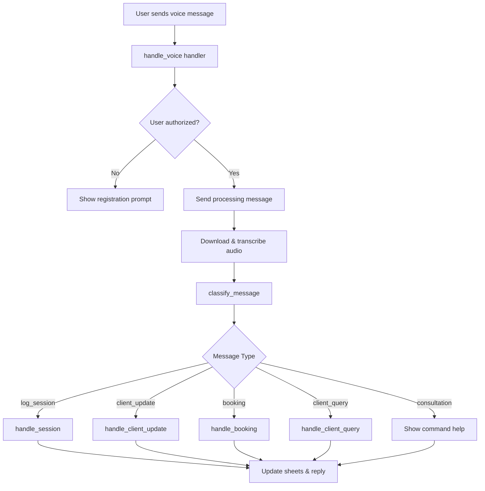
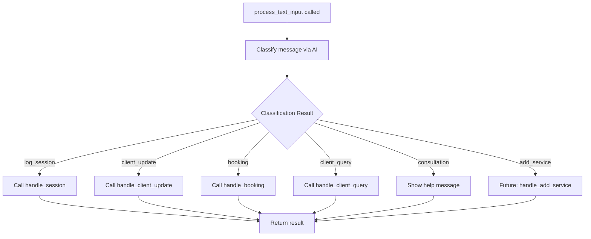
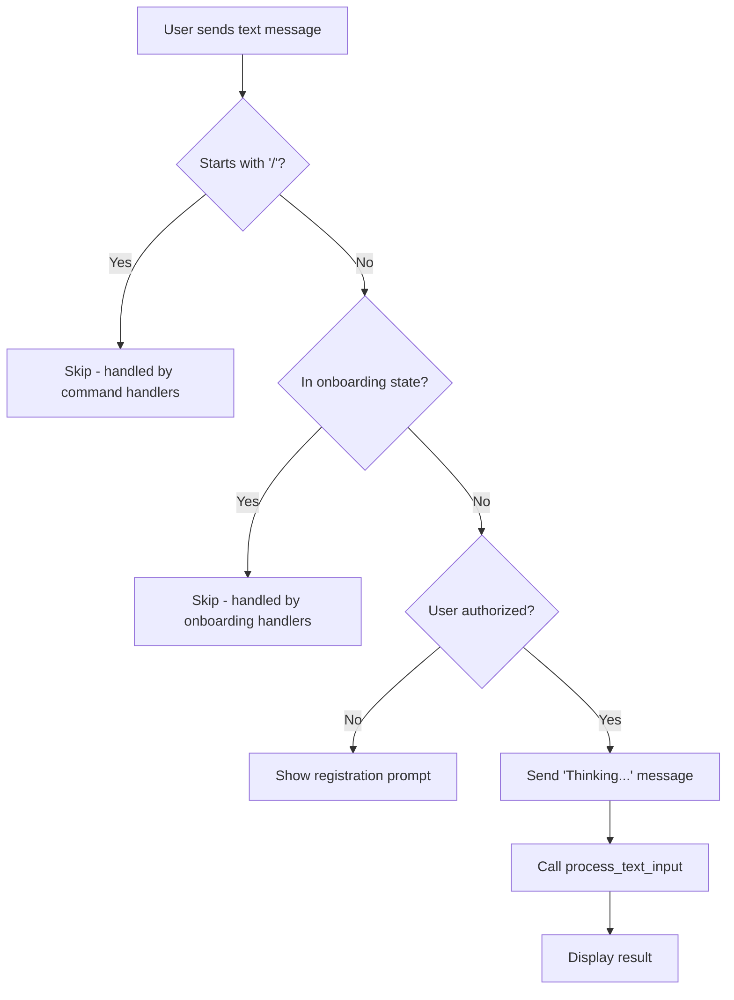
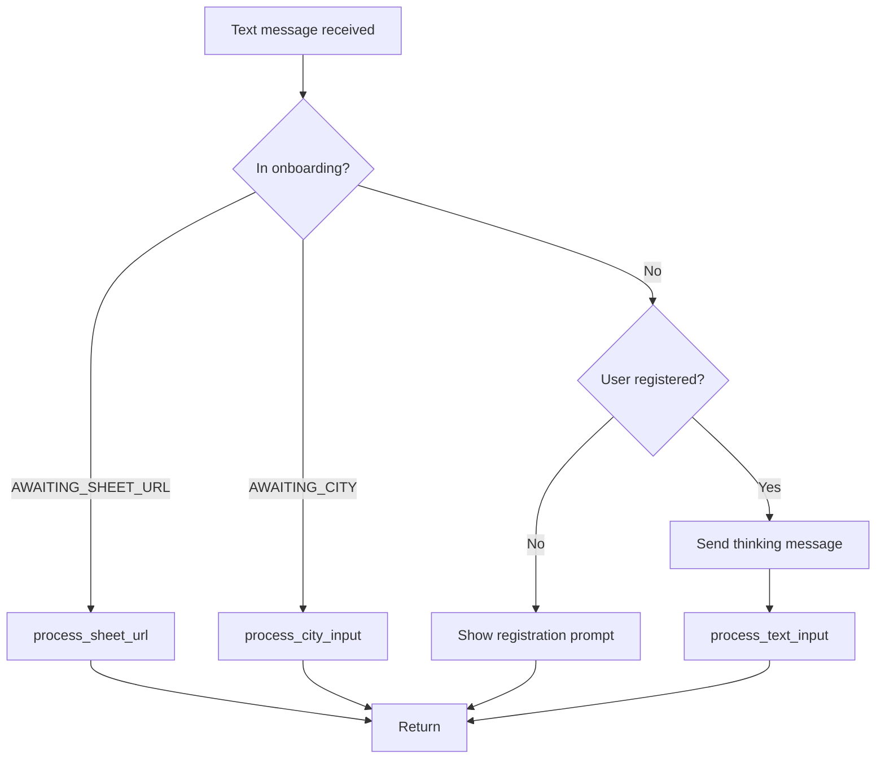
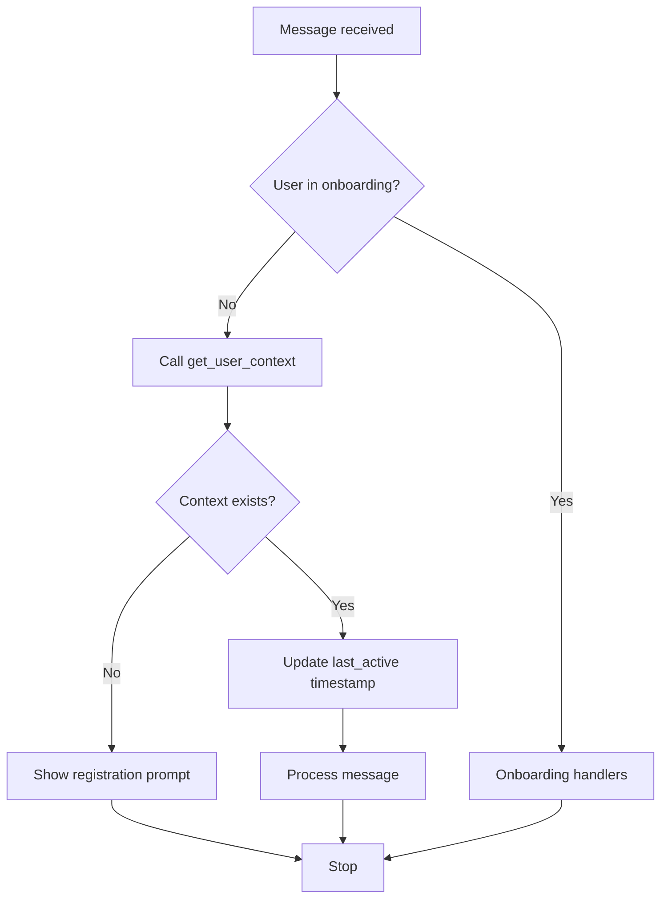

# Text Message Support for Massage CRM Bot

## Overview

Extend the Massage Therapist SaaS Bot to accept text messages in addition to voice messages, enabling users to perform all existing actions (session logging, booking, client updates, queries) via typed input without code duplication.

## Business Context

Currently, users must send voice messages to interact with the bot. While voice input is convenient for therapists working with clients, there are scenarios where text input is preferable:

- Quiet environments where speaking is inconvenient
- Faster input for simple entries
- Accessibility for users who prefer typing
- Situations with poor audio quality

## Design Goals

1. **Feature Parity**: Text messages must support all operations currently available via voice
2. **DRY Principle**: Extract shared business logic to avoid duplication
3. **Consistent UX**: Text messages receive identical processing and response quality
4. **Authorization**: Apply same authentication checks as voice messages
5. **Command Preservation**: Text handler must not interfere with existing commands (`/start`, `/client`, etc.)

## Current Architecture Analysis

### Existing Voice Message Flow



### Current Text Handler Behavior

The existing `handle_text` function (lines 284-313) currently only handles:
- Onboarding flow: sheet URL input
- Onboarding flow: city input for timezone
- Fallback message for registered users directing them to use voice or commands

It does **not** process general text input for session logging or other CRM operations.

## Proposed Solution

### Architecture Changes

#### 1. Extract Shared Business Logic

Create a new centralized function that handles message processing regardless of input method:

**Function Signature:**
```
async def process_text_input(
    message: Message, 
    text: str, 
    processing_msg: Message, 
    sheet_id: str, 
    tg_id: int
)
```

**Responsibilities:**
- Classify message intent using AI service
- Route to appropriate handler based on classification
- Handle errors uniformly
- Log operations consistently

**Flow:**



#### 2. Refactor Voice Handler

Modify `handle_voice` (lines 408-470) to delegate to shared logic:

**Responsibilities:**
- Authorization check
- Send initial processing message
- Download and transcribe audio
- Call `process_text_input` with transcription
- Handle transcription-specific errors

**Workflow Changes:**

| Before | After |
|--------|-------|
| Transcribe → Classify → Route → Handle | Transcribe → process_text_input |
| Duplication of routing logic | Shared routing via extraction |
| Direct calls to handlers | Delegated calls through central function |

#### 3. Create New Text Message Handler

Add new handler function to process text input:

**Handler Decorator:**
```
@dp.message(F.text & ~F.text.startswith("/"))
```

**Filter Logic:**
- Accept: Regular text messages
- Reject: Commands starting with `/` (to preserve command handlers)
- Reject: Messages during onboarding states (URL/city input)

**Workflow:**



**Responsibilities:**
- Check authorization (same as voice handler)
- Verify not in onboarding state
- Verify not a command
- Send feedback message ("⏳ Thinking...")
- Call `process_text_input` with message text
- Handle errors

## Implementation Specification

### Component Changes

#### A. New Function: `process_text_input`

**Location:** bot.py (insert after `get_user_context`, before handlers)

**Parameters:**

| Parameter | Type | Description |
|-----------|------|-------------|
| message | Message | Original Telegram message object |
| text | str | Text to process (transcription or direct text) |
| processing_msg | Message | Status message to update with results |
| sheet_id | str | User's Google Sheets ID |
| tg_id | int | User's Telegram ID |

**Logic:**
1. Call `ai_service.classify_message(text)` to determine intent
2. Based on classification result:
   - `"log_session"` → `await handle_session(message, processing_msg, text, sheet_id, tg_id)`
   - `"client_update"` → `await handle_client_update(message, processing_msg, text, sheet_id, tg_id)`
   - `"booking"` → `await handle_booking(message, processing_msg, text, sheet_id, tg_id)`
   - `"client_query"` → `await handle_client_query(message, processing_msg, text, sheet_id, tg_id)`
   - `"consultation"` → Update processing message with command help
   - Default → Fall back to `handle_session`
3. Wrap all operations in try/except block
4. Log errors with privacy compliance (no message content, only metadata)

**Error Handling:**
- Catch all exceptions
- Update processing message with user-friendly error
- Log technical details for debugging

#### B. Modified Function: `handle_voice`

**Changes:**

| Step | Before | After |
|------|--------|-------|
| Authorization | Same | Same |
| Processing message | "🎧 Обрабатываю голосовое сообщение..." | Same |
| Transcription | Download & transcribe | Same |
| Classification | Call `classify_message` | Remove - moved to shared function |
| Routing | Switch on message_type | Remove - moved to shared function |
| Handler calls | Direct calls | Call `process_text_input(message, transcription, processing_msg, sheet_id, tg_id)` |

**New Structure:**
1. Authorization check
2. Send processing message
3. Download and transcribe audio
4. Clean up audio file
5. Handle transcription failure
6. Call `process_text_input` with transcription
7. Log operation

#### C. New Handler: `handle_text` (Replacement)

**Current Behavior:** Only handles onboarding and shows help message

**New Behavior:** Process text messages for CRM operations

**Implementation Strategy:**

The existing `handle_text` function needs conditional logic to maintain backward compatibility with onboarding:

**Filter Conditions:**
1. Message is text (F.text)
2. Does not start with "/" (~F.text.startswith("/"))

**Processing Logic:**



**Steps:**
1. Check if user is in onboarding state:
   - If `AWAITING_SHEET_URL` → call `process_sheet_url` (existing)
   - If `AWAITING_CITY` → call `process_city_input` (existing)
   - Otherwise → proceed to step 2
2. Verify user authorization via `get_user_context`
3. If not authorized → show registration prompt and return
4. Send feedback message: "⏳ Думаю..." (Thinking...)
5. Call `process_text_input(message, message.text, processing_msg, sheet_id, tg_id)`
6. Handle errors gracefully

**Authorization Flow:**

| Scenario | Action |
|----------|--------|
| User not in database | Show "❌ Вы не зарегистрированы. Отправьте /start для регистрации." |
| User registered | Process text input |
| Onboarding in progress | Delegate to onboarding handlers |

#### D. Handler Function Compatibility

All existing handler functions already accept the correct signature:

**Current Signatures:**
- `handle_session(message, processing_msg, transcription, sheet_id, tg_id)`
- `handle_client_update(message, processing_msg, transcription, sheet_id, tg_id)`
- `handle_booking(message, processing_msg, transcription, sheet_id, tg_id)`
- `handle_client_query(message, processing_msg, transcription, sheet_id, tg_id)`

**Required Changes:** None - handlers are already compatible

The parameter name `transcription` is semantically misleading when called with direct text, but functionally correct (both are strings containing user input).

**Optional Refactoring Consideration:**
Parameter could be renamed to `user_input` for clarity, but this is cosmetic and not required for functionality.

### User Experience Specification

#### Success Scenarios

**Scenario 1: Session Logging via Text**

| Step | User Action | Bot Response |
|------|-------------|--------------|
| 1 | Types: "Приходила Анна, ШВЗ, 3000 рублей" | "⏳ Думаю..." |
| 2 | - | Classification: log_session |
| 3 | - | Updates message: "✅ Сеанс записан

👤 Клиент: Анна
💆‍♀️ Услуга: ШВЗ
💰 Цена: 3000₽" |

**Scenario 2: Booking via Text**

| Step | User Action | Bot Response |
|------|-------------|--------------|
| 1 | Types: "Запиши Ольгу на завтра в 14:00" | "⏳ Думаю..." |
| 2 | - | Classification: booking |
| 3 | - | Updates message: "✅ Запись создана

📅 [date] (Среда) в 14:00
👤 Клиент: Ольга" |

**Scenario 3: Client Update via Text**

| Step | User Action | Bot Response |
|------|-------------|--------------|
| 1 | Types: "У Анны аллергия на лаванду" | "⏳ Думаю..." |
| 2 | - | Classification: client_update |
| 3 | - | Updates message: "📝 Заметка добавлена в карту клиента

👤 Клиент: Анна
📖 Раздел: Анамнез

✅ Добавлено: \"Аллергия на лаванду\"" |

**Scenario 4: Client Query via Text**

| Step | User Action | Bot Response |
|------|-------------|--------------|
| 1 | Types: "Кто такая Мария?" | "⏳ Думаю..." |
| 2 | - | Classification: client_query |
| 3 | - | Shows full client card with history, LTV, bookings |

#### Command Preservation

| User Input | Handler | Behavior |
|------------|---------|----------|
| "/start" | cmd_start | ✅ Unchanged - command handler |
| "/client Анна" | cmd_client | ✅ Unchanged - command handler |
| "/stats" | cmd_stats | ✅ Unchanged - command handler |
| "/set_timezone Москва" | cmd_set_timezone | ✅ Unchanged - command handler |
| "Запиши сеанс" | handle_text → process_text_input | ✅ NEW - text processing |
| [Sheet URL during onboarding] | handle_text → process_sheet_url | ✅ Unchanged - onboarding handler |

### Processing Messages

To provide feedback that the bot is working:

| Input Method | Initial Message | Purpose |
|--------------|-----------------|---------|
| Voice | "🎧 Обрабатываю голосовое сообщение..." | Indicates audio processing |
| Text | "⏳ Думаю..." (Thinking...) | Indicates AI classification |

Both messages are subsequently edited with final results.

### Error Handling Strategy

**Transcription Errors (Voice Only):**
- Scenario: Whisper API fails or returns empty
- Response: "🤷‍♂️ Не удалось распознать аудио. Попробуйте еще раз."
- Fallback: None - user must retry

**Classification Errors:**
- Scenario: AI service fails to classify
- Response: Default to `"log_session"` intent
- Logging: Error logged with technical details

**Handler Errors:**
- Scenario: Any exception in handler functions
- Response: "❌ Ошибка обработки: [error message]"
- Logging: Full stack trace logged

**Permission Errors:**
- Scenario: Sheet access denied
- Response: "🚫 Я потерял доступ к вашей таблице..." with recovery instructions
- Applies to: Both voice and text equally

## Authorization Model

Both voice and text inputs share identical authorization flow:



**Authorization Checks:**
1. Retrieve user context via `get_user_context(tg_id)`
2. Context includes: `sheet_id` and `tg_id`
3. If context is None → user not registered → show prompt
4. If context exists → update `last_active_at` timestamp → proceed

**No Changes Required:** Existing authorization mechanism fully supports text messages.

## Privacy & Logging Compliance

**Current Standard (must be maintained):**
- Never log message content (voice transcriptions or text messages)
- Log only metadata: message length, user ID (anonymized as TG_ID), operation type
- Comply with data protection standards

**Logging Examples:**

| Event | Log Entry |
|-------|-----------|
| Voice message processed | `User <TG_ID:123456> sent voice message, transcription length: 45 chars` |
| Text message processed | `User <TG_ID:123456> sent text message, length: 38 chars` |
| Session logged | `User <TG_ID:123456> logged a session` |
| Client updated | `User <TG_ID:123456> updated client info` |

## AI Service Integration

**No Changes Required to AI Service:**

The AI service (`services/ai.py`) already provides all necessary functions:
- `classify_message(text: str)` - Works with any text input
- `parse_session(text: str, ...)` - Accepts transcription or typed text
- `parse_booking(text: str, ...)` - Accepts transcription or typed text
- `parse_client_edit(text: str)` - Accepts transcription or typed text
- `parse_client_query(text: str)` - Accepts transcription or typed text

All parsing functions are text-agnostic and work identically for voice transcriptions and direct text input.

## Database Integration

**No Changes Required:**

The database service (`database.py`) already supports:
- User registration and lookup
- Timezone storage and retrieval
- Last activity tracking
- Authorization checks

Text message users are indistinguishable from voice users in the database.

## Sheets Service Integration

**No Changes Required:**

The Google Sheets service (`services/sheets.py`) receives identical data structures regardless of input method:
- `log_session(sheet_id, session_data)` - Works with any text source
- `add_booking(sheet_id, booking_data)` - Works with any text source
- `update_client_info(sheet_id, edit_data)` - Works with any text source
- `get_client(sheet_id, client_name)` - Works with any text source

## Testing Considerations

### Test Scenarios

**Functional Equivalence Tests:**

| Test Case | Voice Input | Text Input | Expected Outcome |
|-----------|-------------|------------|------------------|
| Session Logging | "Приходила Анна, массаж, 3000" | "Приходила Анна, массаж, 3000" | Identical session record in sheets |
| Booking Creation | "Запиши Ольгу на завтра в 14:00" | "Запиши Ольгу на завтра в 14:00" | Identical booking in sheets |
| Client Update | "У Ивана аллергия на мёд" | "У Ивана аллергия на мёд" | Identical update to client anamnesis |
| Client Query | "Кто такая Мария?" | "Кто такая Мария?" | Identical client card response |

**Filter Tests:**

| Input | Expected Handler | Reason |
|-------|------------------|--------|
| "/start" | cmd_start | Command prefix filter |
| "/client Anna" | cmd_client | Command prefix filter |
| "записать сеанс" | handle_text → process_text_input | Text without command prefix |
| [Google Sheets URL] | process_sheet_url | Onboarding state AWAITING_SHEET_URL |
| "Москва" | process_city_input | Onboarding state AWAITING_CITY |

**Authorization Tests:**

| User State | Input Type | Expected Behavior |
|------------|------------|-------------------|
| Not registered | Voice | Registration prompt |
| Not registered | Text | Registration prompt |
| Registered | Voice | Process message |
| Registered | Text | Process message |

**Error Handling Tests:**

| Scenario | Expected Behavior |
|----------|-------------------|
| Text input during onboarding | Route to onboarding handlers |
| Command via text | Route to command handlers |
| Invalid classification | Default to session logging |
| Sheet permission error | Show permission recovery message |

## Migration Impact

**No Breaking Changes:**

This feature is purely additive and does not modify existing functionality:
- Voice message handling remains identical
- Command handlers unchanged
- Onboarding flow unchanged
- Database schema unchanged
- Sheets integration unchanged

**Backward Compatibility:**

All existing users can continue using voice messages exclusively without any awareness of text message support.

## Performance Considerations

**Comparison: Voice vs Text Processing**

| Step | Voice | Text | Difference |
|------|-------|------|------------|
| Input reception | ~0ms | ~0ms | None |
| Download audio | ~200-500ms | N/A | Text is faster |
| Transcription (Whisper API) | ~1-3 seconds | N/A | Text skips this |
| Classification (AI) | ~500-1000ms | ~500-1000ms | Same |
| Parsing (AI) | ~500-1500ms | ~500-1500ms | Same |
| Sheets update | ~300-800ms | ~300-800ms | Same |
| **Total** | ~3-6 seconds | ~1.5-3.5 seconds | Text 50% faster |

**Resource Usage:**

Text messages consume fewer resources:
- No audio file storage (temporary `/tmp` usage eliminated)
- No audio download bandwidth
- No Whisper API calls (saves OpenAI quota)
- Lower latency for users

**Scalability:**

Text message support improves bot scalability:
- Reduced I/O operations (no file downloads)
- Lower API costs (no transcription fees)
- Faster response times improve user satisfaction

## Configuration Changes

**No Configuration Changes Required:**

All existing environment variables remain unchanged:
- `BOT_TOKEN` - Same
- `OPENAI_API_KEY` - Same (used for classification and parsing)
- `GOOGLE_SHEETS_CREDENTIALS_BASE64` - Same
- `TEMPLATE_SHEET_URL` - Same
- `DATABASE_PATH` - Same
- `TIMEZONE` - Same

## Deployment Considerations

**Deployment Type:** Code-only change, no infrastructure updates

**Rollout Strategy:**
1. Deploy updated `bot.py` with refactored handlers
2. Restart bot service
3. No database migrations required
4. No user action required

**Rollback Plan:**

If issues arise, revert to previous `bot.py` version:
- No data corruption risk (database unchanged)
- No user data loss (sheets unchanged)
- Users can continue with voice messages during rollback

## Success Metrics

**Adoption Metrics:**

| Metric | Description | Target |
|--------|-------------|--------|
| Text message usage rate | % of messages via text vs voice | Monitor |
| Text message success rate | % of text messages successfully processed | >95% |
| Text message error rate | % of text messages resulting in errors | <5% |
| Average text response time | Time from text input to bot response | <3 seconds |

**Quality Metrics:**

| Metric | Description | Target |
|--------|-------------|--------|
| Classification accuracy | % of text messages correctly classified | >90% |
| Parsing accuracy | % of text messages correctly parsed | >85% |
| User retry rate | % of users retrying after errors | <10% |

## Future Enhancements

**Potential Extensions:**

1. **Rich Text Formatting**: Support for markdown in text messages for complex notes
2. **Batch Operations**: Allow multiple operations in single text message
3. **Quick Replies**: Provide inline keyboard buttons for common actions
4. **Command Shortcuts**: Text-based shortcuts like "log:" or "book:" prefixes
5. **Hybrid Input**: Voice message with text corrections/additions

**Not in Scope:**

- Multi-language support (current: Russian only)
- Voice synthesis for responses
- Image recognition for receipts/notes
- Third-party integrations (calendar sync, etc.)
The existing `handle_text` function (lines 284-313) currently only handles:
- Onboarding flow: sheet URL input
- Onboarding flow: city input for timezone
- Fallback message for registered users directing them to use voice or commands

It does **not** process general text input for session logging or other CRM operations.

## Proposed Solution

### Architecture Changes

#### 1. Extract Shared Business Logic

Create a new centralized function that handles message processing regardless of input method:

**Function Signature:**
```
async def process_text_input(
    message: Message, 
    text: str, 
    processing_msg: Message, 
    sheet_id: str, 
    tg_id: int
)
```

**Responsibilities:**
- Classify message intent using AI service
- Route to appropriate handler based on classification
- Handle errors uniformly
- Log operations consistently

**Flow:**


#### 2. Refactor Voice Handler

Modify `handle_voice` (lines 408-470) to delegate to shared logic:

**Responsibilities:**
- Authorization check
- Send initial processing message
- Download and transcribe audio
- Call `process_text_input` with transcription
- Handle transcription-specific errors

**Workflow Changes:**

| Before | After |
|--------|-------|
| Transcribe → Classify → Route → Handle | Transcribe → process_text_input |
| Duplication of routing logic | Shared routing via extraction |
| Direct calls to handlers | Delegated calls through central function |

#### 3. Create New Text Message Handler

Add new handler function to process text input:

**Handler Decorator:**
```
@dp.message(F.text & ~F.text.startswith("/"))
```

**Filter Logic:**
- Accept: Regular text messages
- Reject: Commands starting with `/` (to preserve command handlers)
- Reject: Messages during onboarding states (URL/city input)

**Workflow:**


**Responsibilities:**
- Check authorization (same as voice handler)
- Verify not in onboarding state
- Verify not a command
- Send feedback message ("⏳ Thinking...")
- Call `process_text_input` with message text
- Handle errors

## Implementation Specification

### Component Changes

#### A. New Function: `process_text_input`

**Location:** bot.py (insert after `get_user_context`, before handlers)

**Parameters:**

| Parameter | Type | Description |
|-----------|------|-------------|
| message | Message | Original Telegram message object |
| text | str | Text to process (transcription or direct text) |
| processing_msg | Message | Status message to update with results |
| sheet_id | str | User's Google Sheets ID |
| tg_id | int | User's Telegram ID |

**Logic:**
1. Call `ai_service.classify_message(text)` to determine intent
2. Based on classification result:
   - `"log_session"` → `await handle_session(message, processing_msg, text, sheet_id, tg_id)`
   - `"client_update"` → `await handle_client_update(message, processing_msg, text, sheet_id, tg_id)`
   - `"booking"` → `await handle_booking(message, processing_msg, text, sheet_id, tg_id)`
   - `"client_query"` → `await handle_client_query(message, processing_msg, text, sheet_id, tg_id)`
   - `"consultation"` → Update processing message with command help
   - Default → Fall back to `handle_session`
3. Wrap all operations in try/except block
4. Log errors with privacy compliance (no message content, only metadata)

**Error Handling:**
- Catch all exceptions
- Update processing message with user-friendly error
- Log technical details for debugging

#### B. Modified Function: `handle_voice`

**Changes:**

| Step | Before | After |
|------|--------|-------|
| Authorization | Same | Same |
| Processing message | "🎧 Обрабатываю голосовое сообщение..." | Same |
| Transcription | Download & transcribe | Same |
| Classification | Call `classify_message` | Remove - moved to shared function |
| Routing | Switch on message_type | Remove - moved to shared function |
| Handler calls | Direct calls | Call `process_text_input(message, transcription, processing_msg, sheet_id, tg_id)` |

**New Structure:**
1. Authorization check
2. Send processing message
3. Download and transcribe audio
4. Clean up audio file
5. Handle transcription failure
6. Call `process_text_input` with transcription
7. Log operation

#### C. New Handler: `handle_text` (Replacement)

**Current Behavior:** Only handles onboarding and shows help message

**New Behavior:** Process text messages for CRM operations

**Implementation Strategy:**

The existing `handle_text` function needs conditional logic to maintain backward compatibility with onboarding:

**Filter Conditions:**
1. Message is text (F.text)
2. Does not start with "/" (~F.text.startswith("/"))

**Processing Logic:**


**Steps:**
1. Check if user is in onboarding state:
   - If `AWAITING_SHEET_URL` → call `process_sheet_url` (existing)
   - If `AWAITING_CITY` → call `process_city_input` (existing)
   - Otherwise → proceed to step 2
2. Verify user authorization via `get_user_context`
3. If not authorized → show registration prompt and return
4. Send feedback message: "⏳ Думаю..." (Thinking...)
5. Call `process_text_input(message, message.text, processing_msg, sheet_id, tg_id)`
6. Handle errors gracefully

**Authorization Flow:**

| Scenario | Action |
|----------|--------|
| User not in database | Show "❌ Вы не зарегистрированы. Отправьте /start для регистрации." |
| User registered | Process text input |
| Onboarding in progress | Delegate to onboarding handlers |

#### D. Handler Function Compatibility

All existing handler functions already accept the correct signature:

**Current Signatures:**
- `handle_session(message, processing_msg, transcription, sheet_id, tg_id)`
- `handle_client_update(message, processing_msg, transcription, sheet_id, tg_id)`
- `handle_booking(message, processing_msg, transcription, sheet_id, tg_id)`
- `handle_client_query(message, processing_msg, transcription, sheet_id, tg_id)`

**Required Changes:** None - handlers are already compatible

The parameter name `transcription` is semantically misleading when called with direct text, but functionally correct (both are strings containing user input).

**Optional Refactoring Consideration:**
Parameter could be renamed to `user_input` for clarity, but this is cosmetic and not required for functionality.

### User Experience Specification

#### Success Scenarios

**Scenario 1: Session Logging via Text**

| Step | User Action | Bot Response |
|------|-------------|--------------|
| 1 | Types: "Приходила Анна, ШВЗ, 3000 рублей" | "⏳ Думаю..." |
| 2 | - | Classification: log_session |
| 3 | - | Updates message: "✅ Сеанс записан\n\n👤 Клиент: Анна\n💆‍♀️ Услуга: ШВЗ\n💰 Цена: 3000₽" |

**Scenario 2: Booking via Text**

| Step | User Action | Bot Response |
|------|-------------|--------------|
| 1 | Types: "Запиши Ольгу на завтра в 14:00" | "⏳ Думаю..." |
| 2 | - | Classification: booking |
| 3 | - | Updates message: "✅ Запись создана\n\n📅 [date] (Среда) в 14:00\n👤 Клиент: Ольга" |

**Scenario 3: Client Update via Text**

| Step | User Action | Bot Response |
|------|-------------|--------------|
| 1 | Types: "У Анны аллергия на лаванду" | "⏳ Думаю..." |
| 2 | - | Classification: client_update |
| 3 | - | Updates message: "📝 Заметка добавлена в карту клиента\n\n👤 Клиент: Анна\n📖 Раздел: Анамнез\n\n✅ Добавлено: \"Аллергия на лаванду\"" |

**Scenario 4: Client Query via Text**

| Step | User Action | Bot Response |
|------|-------------|--------------|
| 1 | Types: "Кто такая Мария?" | "⏳ Думаю..." |
| 2 | - | Classification: client_query |
| 3 | - | Shows full client card with history, LTV, bookings |

#### Command Preservation

| User Input | Handler | Behavior |
|------------|---------|----------|
| "/start" | cmd_start | ✅ Unchanged - command handler |
| "/client Анна" | cmd_client | ✅ Unchanged - command handler |
| "/stats" | cmd_stats | ✅ Unchanged - command handler |
| "/set_timezone Москва" | cmd_set_timezone | ✅ Unchanged - command handler |
| "Запиши сеанс" | handle_text → process_text_input | ✅ NEW - text processing |
| [Sheet URL during onboarding] | handle_text → process_sheet_url | ✅ Unchanged - onboarding handler |

### Processing Messages

To provide feedback that the bot is working:

| Input Method | Initial Message | Purpose |
|--------------|-----------------|---------|
| Voice | "🎧 Обрабатываю голосовое сообщение..." | Indicates audio processing |
| Text | "⏳ Думаю..." (Thinking...) | Indicates AI classification |

Both messages are subsequently edited with final results.

### Error Handling Strategy

**Transcription Errors (Voice Only):**
- Scenario: Whisper API fails or returns empty
- Response: "🤷‍♂️ Не удалось распознать аудио. Попробуйте еще раз."
- Fallback: None - user must retry

**Classification Errors:**
- Scenario: AI service fails to classify
- Response: Default to `"log_session"` intent
- Logging: Error logged with technical details

**Handler Errors:**
- Scenario: Any exception in handler functions
- Response: "❌ Ошибка обработки: [error message]"
- Logging: Full stack trace logged

**Permission Errors:**
- Scenario: Sheet access denied
- Response: "🚫 Я потерял доступ к вашей таблице..." with recovery instructions
- Applies to: Both voice and text equally

## Authorization Model

Both voice and text inputs share identical authorization flow:


**Authorization Checks:**
1. Retrieve user context via `get_user_context(tg_id)`
2. Context includes: `sheet_id` and `tg_id`
3. If context is None → user not registered → show prompt
4. If context exists → update `last_active_at` timestamp → proceed

**No Changes Required:** Existing authorization mechanism fully supports text messages.

## Privacy & Logging Compliance

**Current Standard (must be maintained):**
- Never log message content (voice transcriptions or text messages)
- Log only metadata: message length, user ID (anonymized as TG_ID), operation type
- Comply with data protection standards

**Logging Examples:**

| Event | Log Entry |
|-------|-----------|
| Voice message processed | `User <TG_ID:123456> sent voice message, transcription length: 45 chars` |
| Text message processed | `User <TG_ID:123456> sent text message, length: 38 chars` |
| Session logged | `User <TG_ID:123456> logged a session` |
| Client updated | `User <TG_ID:123456> updated client info` |

## AI Service Integration

**No Changes Required to AI Service:**

The AI service (`services/ai.py`) already provides all necessary functions:
- `classify_message(text: str)` - Works with any text input
- `parse_session(text: str, ...)` - Accepts transcription or typed text
- `parse_booking(text: str, ...)` - Accepts transcription or typed text
- `parse_client_edit(text: str)` - Accepts transcription or typed text
- `parse_client_query(text: str)` - Accepts transcription or typed text

All parsing functions are text-agnostic and work identically for voice transcriptions and direct text input.

## Database Integration

**No Changes Required:**

The database service (`database.py`) already supports:
- User registration and lookup
- Timezone storage and retrieval
- Last activity tracking
- Authorization checks

Text message users are indistinguishable from voice users in the database.

## Sheets Service Integration

**No Changes Required:**

The Google Sheets service (`services/sheets.py`) receives identical data structures regardless of input method:
- `log_session(sheet_id, session_data)` - Works with any text source
- `add_booking(sheet_id, booking_data)` - Works with any text source
- `update_client_info(sheet_id, edit_data)` - Works with any text source
- `get_client(sheet_id, client_name)` - Works with any text source

## Testing Considerations

### Test Scenarios

**Functional Equivalence Tests:**

| Test Case | Voice Input | Text Input | Expected Outcome |
|-----------|-------------|------------|------------------|
| Session Logging | "Приходила Анна, массаж, 3000" | "Приходила Анна, массаж, 3000" | Identical session record in sheets |
| Booking Creation | "Запиши Ольгу на завтра в 14:00" | "Запиши Ольгу на завтра в 14:00" | Identical booking in sheets |
| Client Update | "У Ивана аллергия на мёд" | "У Ивана аллергия на мёд" | Identical update to client anamnesis |
| Client Query | "Кто такая Мария?" | "Кто такая Мария?" | Identical client card response |

**Filter Tests:**

| Input | Expected Handler | Reason |
|-------|------------------|--------|
| "/start" | cmd_start | Command prefix filter |
| "/client Anna" | cmd_client | Command prefix filter |
| "записать сеанс" | handle_text → process_text_input | Text without command prefix |
| [Google Sheets URL] | process_sheet_url | Onboarding state AWAITING_SHEET_URL |
| "Москва" | process_city_input | Onboarding state AWAITING_CITY |

**Authorization Tests:**

| User State | Input Type | Expected Behavior |
|------------|------------|-------------------|
| Not registered | Voice | Registration prompt |
| Not registered | Text | Registration prompt |
| Registered | Voice | Process message |
| Registered | Text | Process message |

**Error Handling Tests:**

| Scenario | Expected Behavior |
|----------|-------------------|
| Text input during onboarding | Route to onboarding handlers |
| Command via text | Route to command handlers |
| Invalid classification | Default to session logging |
| Sheet permission error | Show permission recovery message |

## Migration Impact

**No Breaking Changes:**

This feature is purely additive and does not modify existing functionality:
- Voice message handling remains identical
- Command handlers unchanged
- Onboarding flow unchanged
- Database schema unchanged
- Sheets integration unchanged

**Backward Compatibility:**

All existing users can continue using voice messages exclusively without any awareness of text message support.

## Performance Considerations

**Comparison: Voice vs Text Processing**

| Step | Voice | Text | Difference |
|------|-------|------|------------|
| Input reception | ~0ms | ~0ms | None |
| Download audio | ~200-500ms | N/A | Text is faster |
| Transcription (Whisper API) | ~1-3 seconds | N/A | Text skips this |
| Classification (AI) | ~500-1000ms | ~500-1000ms | Same |
| Parsing (AI) | ~500-1500ms | ~500-1500ms | Same |
| Sheets update | ~300-800ms | ~300-800ms | Same |
| **Total** | ~3-6 seconds | ~1.5-3.5 seconds | Text 50% faster |

**Resource Usage:**

Text messages consume fewer resources:
- No audio file storage (temporary `/tmp` usage eliminated)
- No audio download bandwidth
- No Whisper API calls (saves OpenAI quota)
- Lower latency for users

**Scalability:**

Text message support improves bot scalability:
- Reduced I/O operations (no file downloads)
- Lower API costs (no transcription fees)
- Faster response times improve user satisfaction

## Configuration Changes

**No Configuration Changes Required:**

All existing environment variables remain unchanged:
- `BOT_TOKEN` - Same
- `OPENAI_API_KEY` - Same (used for classification and parsing)
- `GOOGLE_SHEETS_CREDENTIALS_BASE64` - Same
- `TEMPLATE_SHEET_URL` - Same
- `DATABASE_PATH` - Same
- `TIMEZONE` - Same

## Deployment Considerations

**Deployment Type:** Code-only change, no infrastructure updates

**Rollout Strategy:**
1. Deploy updated `bot.py` with refactored handlers
2. Restart bot service
3. No database migrations required
4. No user action required

**Rollback Plan:**

If issues arise, revert to previous `bot.py` version:
- No data corruption risk (database unchanged)
- No user data loss (sheets unchanged)
- Users can continue with voice messages during rollback

## Success Metrics

**Adoption Metrics:**

| Metric | Description | Target |
|--------|-------------|--------|
| Text message usage rate | % of messages via text vs voice | Monitor |
| Text message success rate | % of text messages successfully processed | >95% |
| Text message error rate | % of text messages resulting in errors | <5% |
| Average text response time | Time from text input to bot response | <3 seconds |

**Quality Metrics:**

| Metric | Description | Target |
|--------|-------------|--------|
| Classification accuracy | % of text messages correctly classified | >90% |
| Parsing accuracy | % of text messages correctly parsed | >85% |
| User retry rate | % of users retrying after errors | <10% |

## Future Enhancements

**Potential Extensions:**

1. **Rich Text Formatting**: Support for markdown in text messages for complex notes
2. **Batch Operations**: Allow multiple operations in single text message
3. **Quick Replies**: Provide inline keyboard buttons for common actions
4. **Command Shortcuts**: Text-based shortcuts like "log:" or "book:" prefixes
5. **Hybrid Input**: Voice message with text corrections/additions

**Not in Scope:**

- Multi-language support (current: Russian only)
- Voice synthesis for responses
- Image recognition for receipts/notes
- Third-party integrations (calendar sync, etc.)
