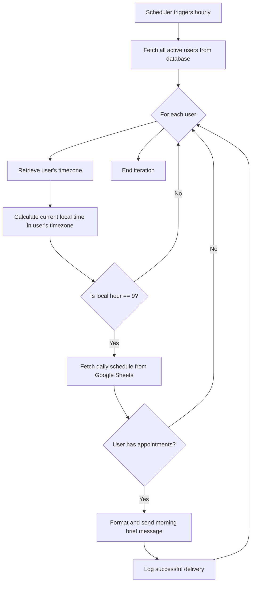
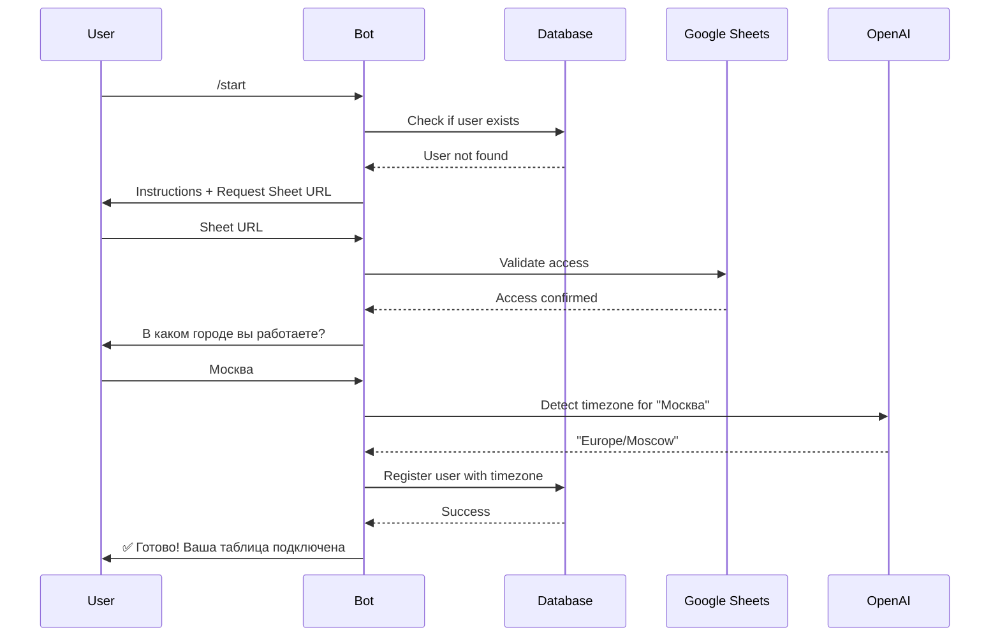
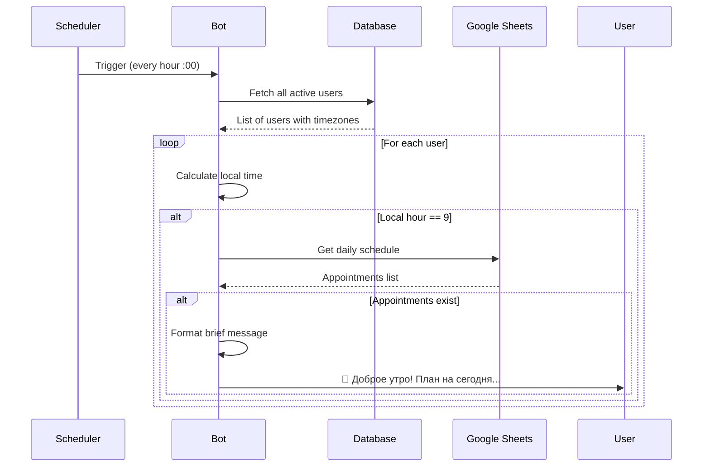
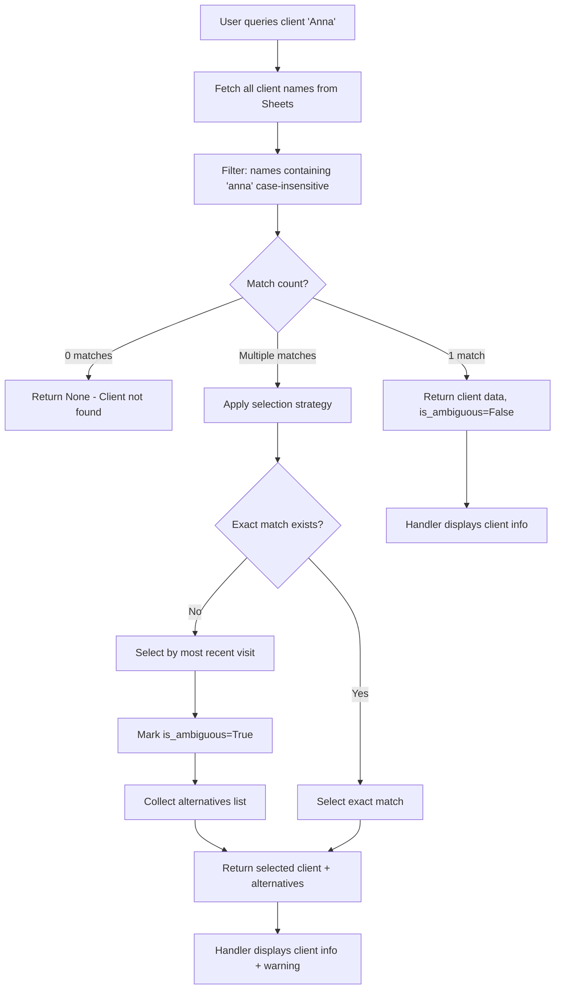

# Timezone-Aware Briefs & Smart Client Search

## Overview

This design document outlines two critical UX improvements for the Massage Therapist SaaS Bot:

1. **Timezone Awareness**: Store user timezones to deliver morning briefs at the correct local time (09:00 AM in each user's timezone)
2. **Smart Client Search**: Handle ambiguous client name matches gracefully by detecting duplicates and providing user feedback

## Business Objectives

### Primary Goals
- Improve user experience by sending morning briefs at the appropriate local time for each user
- Prevent data integrity issues caused by ambiguous client name matching
- Maintain system reliability with proper fallback mechanisms

### Success Criteria
- Morning briefs are delivered at 09:00 AM local time for each user
- Users receive clear warnings when client names are ambiguous
- System handles invalid or missing timezone data without crashes
- Onboarding flow successfully captures and stores timezone information

## Feature Requirements

### 1. Timezone Awareness

#### 1.1 User Timezone Storage

**Database Schema Enhancement**

The users table in SQLite requires a new column to store timezone information:

| Column Name | Data Type | Constraints | Default Value | Description |
|------------|-----------|-------------|---------------|-------------|
| timezone | TEXT | NOT NULL | 'Europe/Moscow' | IANA timezone identifier |

**Migration Strategy**

During application startup, the system must check if the timezone column exists. If missing, an ALTER TABLE operation adds it with the default value. This ensures backward compatibility with existing user records.

**Fallback Behavior**

When timezone data is invalid or missing:
- Primary fallback: Use 'Europe/Moscow' as default
- Secondary fallback: Use UTC if Moscow timezone fails
- Log warning messages for investigation
- Continue operation without interruption

#### 1.2 Onboarding Flow Enhancement

**Current Onboarding Steps**
1. User sends /start command
2. Bot provides instructions to copy template
3. Bot requests Google Sheets URL
4. User provides URL
5. System validates access and registers user

**Enhanced Onboarding Steps**

After successful Google Sheets validation and before final registration:

**Step 1: City Request**

The bot asks the user: "В каком городе вы работаете? (Нужно для настройки времени уведомлений)"

**Step 2: AI-Powered Timezone Detection**

The system sends the city name to GPT-4o-mini with a specialized prompt to extract the IANA timezone identifier.

Example mappings:
- "Новосибирск" → "Asia/Novosibirsk"
- "Москва" → "Europe/Moscow"
- "Владивосток" → "Asia/Vladivostok"
- "Екатеринбург" → "Asia/Yekaterinburg"

**Step 3: Timezone Storage**

The extracted timezone string is saved to the users.timezone column during user registration.

**Onboarding State Management**

Extend the existing onboarding_states dictionary to track the new intermediate state:

State flow: AWAITING_SHEET_URL → AWAITING_CITY → COMPLETE

#### 1.3 Manual Timezone Update

**Command Specification**

Command: `/set_timezone <city>`

**Behavior**
- Extract city name from command arguments
- Validate that user is registered
- Call AI service to detect timezone from city name
- Update users.timezone column
- Confirm successful update to user
- Handle errors gracefully with user-friendly messages

**Example Usage**
```
User: /set_timezone Санкт-Петербург
Bot: ✅ Часовой пояс обновлён: Europe/Moscow
```

#### 1.4 Scheduler Architecture Redesign

**Current Architecture Limitation**

The existing scheduler runs send_morning_briefs once daily at 09:00 Moscow time. This approach fails to account for users in different timezones.

**New Architecture: Rolling Hourly Check**

The scheduler executes a check task every hour at the top of the hour (:00 minute).

**Algorithm Flow**


```mermaid
flowchart TD
    A[Scheduler triggers hourly] --> B[Fetch all active users from database]
    B --> C{For each user}
    C --> D[Retrieve user's timezone]
    D --> E[Calculate current local time in user's timezone]
    E --> F{Is local hour == 9?}
    F -->|Yes| G[Fetch daily schedule from Google Sheets]
    F -->|No| C
    G --> H{User has appointments?}
    H -->|Yes| I[Format and send morning brief message]
    H -->|No| C
    I --> J[Log successful delivery]
    J --> C
    C --> K[End iteration]
```

**Implementation Details**

For each hourly execution:
1. Query database: SELECT tg_id, sheet_id, timezone FROM users WHERE is_active = TRUE
2. For each user record:
   - Parse timezone string using pytz
   - Get current UTC time
   - Convert to user's local time
   - Extract hour component
   - If hour equals 9, proceed with brief generation
   - Otherwise, skip to next user

**Error Handling**
- Invalid timezone string: Fall back to Europe/Moscow, log warning
- Google Sheets access failure: Skip user, log error
- Telegram delivery failure: Continue with next user, log error

**Rate Limiting**
Maintain existing 0.5 second delay between message sends to avoid Telegram API rate limits.

### 2. Smart Client Search

#### 2.1 Problem Statement

Current implementation uses exact case-insensitive matching. When multiple clients have similar names (e.g., "Anna Ivanova" and "Anna Petrova"), a search for "Anna" matches the first occurrence, potentially returning incorrect data.

#### 2.2 Search Result Data Structure

Define a structured response to encapsulate search results and ambiguity information:

| Field | Type | Description |
|-------|------|-------------|
| data | Dictionary | Client record with all fields (Name, Anamnesis, Notes, LTV, etc.) |
| is_ambiguous | Boolean | True if multiple matches were found |
| alternatives | List of Strings | Names of other matching clients (empty if not ambiguous) |

**Conceptual Representation**

```
SearchResult:
  - data: {name, phone_contact, anamnesis, notes, ltv, last_visit_date, next_reminder, session_history}
  - is_ambiguous: boolean
  - alternatives: [list of alternative client names]
```

#### 2.3 Search Algorithm

**Phase 1: Fetch All Client Names**

Retrieve all client names from column A of the Clients worksheet.

**Phase 2: Fuzzy Matching**

Apply case-insensitive substring matching:
- Normalize both search term and client names to lowercase
- Check if search term appears anywhere within each client name
- Collect all matching names

**Phase 3: Selection Strategy**

| Scenario | Match Count | Behavior |
|----------|------------|----------|
| Case 0 | 0 matches | Return None |
| Case 1 | 1 match | Return client data with is_ambiguous=False |
| Case 2 | Multiple matches | Select best match and flag as ambiguous |

**Best Match Selection Criteria**

Priority order:
1. **Exact match** (after case normalization): If search term exactly equals one client name, choose it
2. **Most recent visit**: Select client with the most recent Last_Visit_Date value
3. **First match**: If no visit dates available, use first occurrence

**Phase 4: Return Value Construction**

For ambiguous results:
- data: Contains selected client's full record
- is_ambiguous: True
- alternatives: List of all other matched client names (excluding selected one)

For unambiguous results:
- data: Contains client's full record
- is_ambiguous: False
- alternatives: Empty list

#### 2.4 Integration with Handler Functions

**Affected Handlers**
1. handle_client_query (voice-based client information requests)
2. cmd_client (text command-based client lookup)

**Display Logic**

When is_ambiguous is True, append a warning footer to the response message:

```
⚠️ Найдено несколько совпадений: [alternative1], [alternative2]
Использована: [selected_name]
Если это не та клиентка, уточните запрос.
```

**Example**

```
Search: "Анна"
Matches: ["Анна Иванова", "Анна Петрова"]

Response:
📋 Информация о клиенте

👤 Имя: Анна Иванова
...
[client data]
...

⚠️ Найдено несколько совпадений: Анна Петрова
Использована: Анна Иванова
Если это не та клиентка, уточните запрос.
```

### 3. Timezone-Aware Date Parsing

#### 3.1 Current Issue

When users reference relative dates like "tomorrow" or "next Tuesday", the AI service calculates dates based on server timezone. This causes incorrect date calculations for users in different timezones.

#### 3.2 Solution Approach

**For Session Logging**

Pass user's local current date to the parse_session function, calculated using the user's timezone from the database.

**For Booking Creation**

Pass user's local current date and time to the parse_booking function.

**Implementation Pattern**

Before calling AI parsing functions:
1. Retrieve user's timezone from database
2. Calculate current datetime in user's timezone using pytz
3. Format as YYYY-MM-DD for date context
4. Pass to AI prompt as "Current date for this user is {local_date}"

**AI Prompt Enhancement**

Update system prompts in parse_session, parse_booking, and parse_client_query to accept user-specific current date instead of server date.

## Technical Design

### Database Service Enhancements

**New Methods**

| Method Name | Purpose | Parameters | Return Type |
|------------|---------|------------|-------------|
| get_user_timezone | Retrieve timezone for a user | tg_id (int) | Optional[str] |
| update_user_timezone | Update user's timezone | tg_id (int), timezone (str) | bool |

**get_user_timezone Behavior**
- Query: SELECT timezone FROM users WHERE tg_id = ? AND is_active = TRUE
- Return timezone value or None if user not found
- Return default 'Europe/Moscow' if timezone column is NULL

**update_user_timezone Behavior**
- Execute: UPDATE users SET timezone = ? WHERE tg_id = ?
- Return True on success, False on error
- Log successful updates

**Modified Methods**

get_all_active_users:
- Already returns timezone field (confirmed in code review)
- No changes required

### AI Service Enhancements

**New Function: detect_timezone**

| Parameter | Type | Description |
|-----------|------|-------------|
| city_name | str | City name provided by user |
| Return Value | Optional[str] | IANA timezone identifier or None |

**Function Behavior**

Call OpenAI GPT-4o-mini with specialized prompt:
- Model: gpt-4o-mini
- Temperature: 0 (deterministic)
- Task: Map city name to IANA timezone identifier
- Examples in prompt:
  - Москва → Europe/Moscow
  - Новосибирск → Asia/Novosibirsk
  - Владивосток → Asia/Vladivostok
  - London → Europe/London
  - New York → America/New_York

**Error Handling**
- Invalid city: Return None
- API failure: Return None
- Always log errors for monitoring

**Modified Functions**

parse_session, parse_booking:
- Add optional parameter: user_current_date (str)
- When provided, use in system prompt instead of server date
- Maintain backward compatibility: if not provided, calculate server date

### Sheets Service Enhancements

**Modified Function: get_client**

**Current Signature**
- get_client(sheet_id: str, client_name: str) → Optional[Dict]

**New Signature**
- find_client_with_ambiguity_check(sheet_id: str, search_name: str) → Optional[SearchResult]

**Return Type Structure**

The function returns a dictionary with three keys:
- "data": Client information dictionary (same structure as current get_client)
- "is_ambiguous": Boolean flag
- "alternatives": List of alternative client names

**Alternative Approach: Maintain get_client Compatibility**

To minimize breaking changes, extend the existing get_client function to return additional fields:

Returned dictionary structure:
- All existing fields (name, phone_contact, anamnesis, notes, ltv, etc.)
- New field: "_is_ambiguous" (boolean)
- New field: "_alternatives" (list of strings)

This allows handlers to check for ambiguity while maintaining existing field access patterns.

**Implementation Steps**

1. Retrieve all client records from Clients worksheet
2. Extract Name column values
3. Filter names containing search_name (case-insensitive)
4. If zero matches: return None
5. If one match: return client data with _is_ambiguous=False
6. If multiple matches:
   - Determine best match using selection criteria
   - Retrieve full client record for best match
   - Set _is_ambiguous=True
   - Populate _alternatives with other matched names
   - Return result

### Bot Handler Modifications

**handle_session Enhancement**

Before calling ai_service.parse_session:
1. Retrieve user timezone: timezone = await db_service.get_user_timezone(tg_id)
2. Calculate local date: 
   - Parse timezone with pytz
   - Get current time in that timezone
   - Format as YYYY-MM-DD
3. Pass to parse_session: session_data = await ai_service.parse_session(transcription, user_local_date, service_names)

**handle_booking Enhancement**

Apply same pattern as handle_session for user_local_date calculation.

**handle_client_query Enhancement**

After retrieving client info:
1. Check if "_is_ambiguous" field is True
2. If True, extract "_alternatives" list
3. Append warning footer to response message
4. Format alternatives as comma-separated list

**cmd_client Enhancement**

Apply same pattern as handle_client_query for ambiguity warnings.

**Onboarding Flow Enhancement**

Modify process_sheet_url to transition to city collection state instead of completing immediately:
1. After successful sheet validation
2. Set state: onboarding_states[tg_id] = "AWAITING_CITY"
3. Ask: "В каком городе вы работаете? (Нужно для настройки времени уведомлений)"

Add new handler function: process_city_input
1. Extract city name from message text
2. Call ai_service.detect_timezone(city)
3. If timezone detected:
   - Register user with add_user(tg_id, sheet_id)
   - Update timezone with update_user_timezone(tg_id, timezone)
   - Clear onboarding state
   - Confirm success
4. If timezone detection fails:
   - Use default 'Europe/Moscow'
   - Log warning
   - Proceed with registration

**send_morning_briefs Redesign**

Transition from daily cron job to hourly iteration:

1. Scheduler configuration change:
   - Old: trigger='cron', hour=9, minute=0
   - New: trigger='cron', minute=0 (runs every hour)

2. Function logic modification:
   - For each user in get_all_active_users()
   - Extract timezone from user record
   - Calculate local time: pytz.timezone(user_timezone).localize(datetime.utcnow())
   - Check if local_time.hour == 9
   - If True: fetch schedule and send brief
   - If False: continue to next user

3. Error handling:
   - Wrap timezone parsing in try-except
   - On error: use Europe/Moscow fallback
   - Log all errors for monitoring

### Dependency Management

**New Dependencies**

Add to requirements.txt:
- rapidfuzz==3.6.1 (for advanced fuzzy string matching)

**Rationale for rapidfuzz**

While the initial implementation uses simple substring matching, rapidfuzz provides:
- Levenshtein distance calculation for typo tolerance
- Partial ratio matching for flexible name matching
- Performance optimization for large client lists

**Alternative: Python Standard Library**

For minimal implementation, use built-in string methods:
- str.lower() for case normalization
- substring containment with "in" operator
- No external dependency required

**Recommendation**

Start with standard library implementation. Add rapidfuzz if fuzzy matching becomes a requested feature.

**Updated requirements.txt**

Keep existing dependencies:
- pytz==2024.2 (already present, used for timezone handling)
- aiosqlite==0.20.0 (already present)
- All other existing dependencies remain unchanged

## Data Flow Diagrams

### Onboarding Flow with Timezone Collection


```mermaid
sequenceDiagram
    participant User
    participant Bot
    participant DB as Database
    participant Sheets as Google Sheets
    participant AI as OpenAI

    User->>Bot: /start
    Bot->>DB: Check if user exists
    DB-->>Bot: User not found
    Bot->>User: Instructions + Request Sheet URL
    User->>Bot: Sheet URL
    Bot->>Sheets: Validate access
    Sheets-->>Bot: Access confirmed
    Bot->>User: В каком городе вы работаете?
    User->>Bot: Москва
    Bot->>AI: Detect timezone for "Москва"
    AI-->>Bot: "Europe/Moscow"
    Bot->>DB: Register user with timezone
    DB-->>Bot: Success
    Bot->>User: ✅ Готово! Ваша таблица подключена
```

### Morning Brief Delivery Flow


```mermaid
sequenceDiagram
    participant Scheduler
    participant Bot
    participant DB as Database
    participant Sheets as Google Sheets
    participant User

    Scheduler->>Bot: Trigger (every hour :00)
    Bot->>DB: Fetch all active users
    DB-->>Bot: List of users with timezones
    
    loop For each user
        Bot->>Bot: Calculate local time
        alt Local hour == 9
            Bot->>Sheets: Get daily schedule
            Sheets-->>Bot: Appointments list
            alt Appointments exist
                Bot->>Bot: Format brief message
                Bot->>User: 🌅 Доброе утро! План на сегодня...
            end
        end
    end
```

### Smart Client Search Flow


```mermaid
flowchart TD
    A[User queries client 'Anna'] --> B[Fetch all client names from Sheets]
    B --> C[Filter: names containing 'anna' case-insensitive]
    C --> D{Match count?}
    D -->|0 matches| E[Return None - Client not found]
    D -->|1 match| F[Return client data, is_ambiguous=False]
    D -->|Multiple matches| G[Apply selection strategy]
    G --> H{Exact match exists?}
    H -->|Yes| I[Select exact match]
    H -->|No| J[Select by most recent visit]
    J --> K[Mark is_ambiguous=True]
    K --> L[Collect alternatives list]
    L --> M[Return selected client + alternatives]
    I --> M
    F --> N[Handler displays client info]
    M --> O[Handler displays client info + warning]
```

## Error Handling & Edge Cases

### Timezone Handling

| Scenario | Behavior | Fallback |
|----------|----------|----------|
| Invalid timezone string in DB | Log warning, use fallback | Europe/Moscow |
| City not recognized by AI | Log warning, use fallback | Europe/Moscow |
| pytz parsing fails | Log error, use secondary fallback | UTC |
| User in onboarding doesn't provide city | Timeout after 5 minutes, use default | Europe/Moscow |

### Client Search

| Scenario | Behavior |
|----------|----------|
| No matches found | Return None, display "Client not found" message |
| Exact match among multiple | Prioritize exact match, set is_ambiguous=False |
| All matches have no visit dates | Select first alphabetically, flag as ambiguous |
| Search term is empty string | Return None or prompt user for input |

### Scheduler Resilience

| Scenario | Behavior |
|----------|----------|
| Google Sheets API timeout | Skip user, log error, continue to next |
| Database connection fails | Retry once, if fails skip iteration, log critical error |
| Telegram API rate limit | Respect existing 0.5s delay, catch rate limit exceptions |
| Single user's brief fails | Log error, continue processing other users |

### Onboarding State Management

| Scenario | Behavior |
|----------|----------|
| User sends /start during AWAITING_CITY | Restart onboarding from beginning |
| State exists but >24 hours old | Clear stale state, treat as new user |
| User sends invalid city format | Prompt again with example, max 3 attempts |

## Testing Considerations

### Unit Testing Focus Areas

**Database Layer**
- Verify timezone column creation on initialization
- Test get_user_timezone with existing and non-existent users
- Test update_user_timezone success and failure paths
- Verify default timezone fallback behavior

**AI Service**
- Test detect_timezone with common Russian cities
- Test detect_timezone with international cities
- Verify handling of ambiguous or unknown city names
- Test parse_session and parse_booking with user-specific dates

**Sheets Service**
- Test client search with zero, one, and multiple matches
- Verify exact match prioritization
- Test alternative list construction
- Verify Last_Visit_Date sorting logic

**Scheduler**
- Test hourly execution trigger
- Verify local time calculation for different timezones
- Test filtering logic (hour == 9 check)
- Verify skip behavior for non-9 AM hours

### Integration Testing Scenarios

**End-to-End Onboarding**
1. New user sends /start
2. Provides Sheet URL
3. Provides city name
4. Verify timezone stored in database
5. Verify user can immediately use bot features

**Multi-Timezone Brief Delivery**
1. Register users in Moscow, Vladivostok, and Ekaterinburg timezones
2. Trigger scheduler at different UTC hours
3. Verify each user receives brief at their local 09:00
4. Verify no duplicate deliveries

**Ambiguous Client Search**
1. Add clients "Anna Ivanova" and "Anna Petrova" to test sheet
2. Query for "Anna" via voice and text command
3. Verify warning message appears
4. Verify correct client data returned
5. Verify alternatives listed

### User Acceptance Testing

**Scenarios**
- User in non-Moscow timezone receives morning brief at correct local time
- User updates timezone and receives next brief at new time
- User searches for ambiguous name and receives helpful warning
- User searches for exact name and receives direct result without warning

## Security & Privacy

### Data Handling
- Timezone data is non-sensitive user preference
- City names processed by OpenAI are not personally identifiable
- Maintain existing privacy practices for client names and session data

### Access Control
- Timezone update command requires user registration
- Only authenticated users can modify their own timezone
- Google Sheets access control remains unchanged

## Deployment Strategy

### Phased Rollout

**Phase 1: Database Migration**
- Deploy schema changes (timezone column addition)
- Verify existing users have default timezone
- No user-facing changes yet

**Phase 2: Onboarding Enhancement**
- Enable city collection in onboarding flow
- New users get timezone assignment
- Existing users retain default timezone

**Phase 3: Manual Update Command**
- Release /set_timezone command
- Announce feature to existing users
- Allow gradual timezone correction

**Phase 4: Scheduler Migration**
- Switch to hourly check model
- Monitor logs for timezone calculation errors
- Verify brief delivery times match expectations

**Phase 5: Smart Search Rollout**
- Deploy ambiguity detection
- Monitor warning message frequency
- Collect user feedback

### Rollback Plan

Each phase can be rolled back independently:
- Phase 4 rollback: Revert scheduler to daily Moscow time trigger
- Phase 3 rollback: Disable /set_timezone command
- Phase 2 rollback: Remove city collection step from onboarding
- Phase 1 cannot be rolled back (schema change permanent, but harmless)

### Monitoring

**Key Metrics**
- Percentage of users with non-default timezone
- Morning brief delivery success rate per timezone
- Frequency of ambiguous client matches
- Timezone detection AI success rate
- Average onboarding completion time

**Alerts**
- Morning brief delivery failure rate > 5%
- Timezone detection failure rate > 20%
- Database query timeout on user timezone fetch
- Scheduler execution takes > 5 minutes

## Future Enhancements

### Advanced Fuzzy Matching
- Integrate rapidfuzz for typo tolerance
- Support phonetic matching (e.g., "Olga" matches "Ольга")
- Machine learning-based name disambiguation

### Timezone Automation
- Auto-detect timezone from user's Telegram profile language
- Suggest timezone based on phone number country code
- Allow timezone adjustment via inline keyboard buttons

### Smart Brief Timing
- Allow users to customize brief delivery time (not fixed at 09:00)
- Send briefs only on days with appointments
- Add evening summary option

### Multi-Language Support
- Detect user language preference
- Translate city names for timezone detection
- Localized date/time formatting
- Morning brief delivery success rate per timezone
- Frequency of ambiguous client matches
- Timezone detection AI success rate
- Average onboarding completion time

**Alerts**
- Morning brief delivery failure rate > 5%
- Timezone detection failure rate > 20%
- Database query timeout on user timezone fetch
- Scheduler execution takes > 5 minutes

## Future Enhancements

### Advanced Fuzzy Matching
- Integrate rapidfuzz for typo tolerance
- Support phonetic matching (e.g., "Olga" matches "Ольга")
- Machine learning-based name disambiguation

### Timezone Automation
- Auto-detect timezone from user's Telegram profile language
- Suggest timezone based on phone number country code
- Allow timezone adjustment via inline keyboard buttons

### Smart Brief Timing
- Allow users to customize brief delivery time (not fixed at 09:00)
- Send briefs only on days with appointments
- Add evening summary option

### Multi-Language Support
- Detect user language preference
- Translate city names for timezone detection
- Localized date/time formatting
- Percentage of users with non-default timezone
